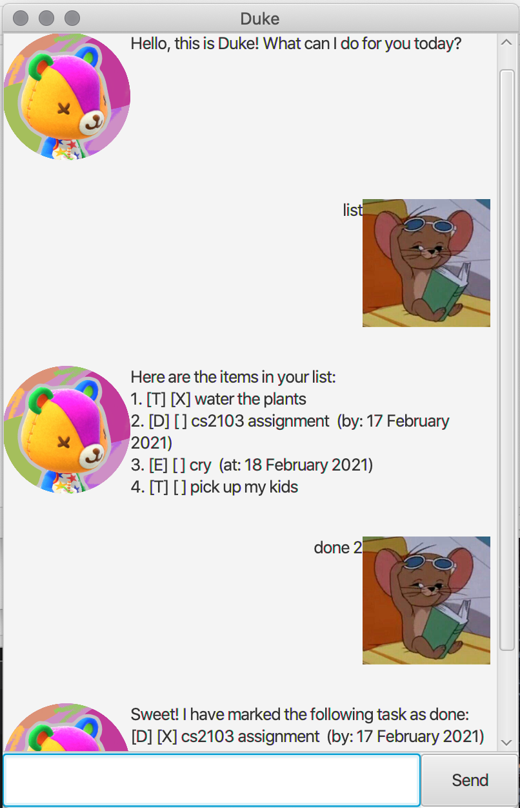

# User Guide

Welcome to Apollo's user guide.

__________________________________________________________

## What is Apollo?

Apollo is a desktop app for managing todos, deadlines and events,
optimised for use via the **command line interface (CLI)**. If you
can type fast, Apollo can perform your tasks management faster than
traditional GUI apps.

__________________________________________________________

## Contents
- Quick Start
- Features
- Usage
- FAQ
- Command Summary

__________________________________________________________

## Quick Start
1. Ensure you have `Java 11` or above installed in your Computer.

2. Download the latest apollo.jar from www.github.com/vevek/ip/releases.

3. Copy the file to the folder you want to use as the home folder for Apollo.

4. Double-click the file to start the app. The GUI should appear in a few seconds.

5. Type the command in the command box and press Enter to execute it.

6. Refer to `Features` below for details on available commands.

__________________________________________________________

## Features

Apollo comes with features build to increase your productivity.

### Managing Tasks
With Apollo you can easily:
1) Add tasks
2) Mark tasks as done
3) List tasks
4) Delete tasks

### Categorise Tasks
There are 3 types of tasks in Apollo. Namely:
1) Todos
   > [T][ ] Read a book
2) Deadlines
   > [D][ ] Submit final year project (by: 03 Mar 2021)
3) Events
   > [E][ ] Math tutorial (at: 17 Feb 2021)
### Search for Tasks
You can easily find tasks by searching with matching keywords.

### Saving of Tasks
Tasks are saved automatically whenever you say "bye" to Apollo.
The saved data (/data/ApolloTaskData.txt) is saved in the same
folder as your Java executable. If no previous saves were found,
a new file would be created for you automatically.

__________________________________________________________          

## Usage
### Adding Todos
`todo` or `t` - Adds a todo.

**Example of usage:**

`todo Read a book`

**Expected outcome:**

> Got it. I've added this task:
>
> [T][ ] Read a book
>
> Now you have 1 task in the list.

A todo has been added.

### Adding Deadlines
`deadline` - Adds a deadline.

**Example of usage:**

`deadline Submit project /by 2021-03-17`

**Expected outcome:**

> Got it. I've added this task:
>
> [D][ ] Submit project (by: 17 Mar 2021)
>
> Now you have 2 task in the list.

A deadline has been added.

### Adding Events
`event` - Adds an event.

**Example of usage:**

`event Math tutorial /at 2021-04-01`

**Expected outcome:**

> Got it. I've added this task:
>
> [E][ ] Math tutorial (at: 01 Apr 2021)
>
> Now you have 3 task in the list.

An event has been added.

### Deleting Tasks
`delete` or `del` - Deletes an event.

**Example of usage:**

`delete 3`

**Expected outcome:**

> Noted. I've removed this task:
>
> [E][ ] Math tutorial (at: 01 Apr 2021)
>
> Now you have 2 task in the list.

A task has been deleted.

### Marking Tasks as Done
`done` or `do` - Marks a task as done.

**Example of usage:**

`done 3`

**Expected outcome:**

> Nice!. I've marked this task as done:
>
> [E][x] Math tutorial (at: 01 Apr 2021)
>
> Now you have 2 task in the list.

A task has been marked as done.

### Search for Tasks
`find` or `f` - Finds a task containing the specific keyword.

**Example of usage:**

`find tutorial`

**Expected outcome:**

> Here are the matching tasks in your list:
>
> 1. [E][x] Math tutorial (at: 01 Apr 2021)

Matching tasks have been found.

### List all Tasks
`list` or `l` - Lists all tasks.

**Example of usage:**

`list`

**Expected outcome:**

> Here are the matching tasks in your list:
>
> 1. [T][ ] Read a book
> 2. [D][ ] Submit project (by: 17 Mar 2021)
> 3. [E][x] Math tutorial (at: 01 Apr 2021)

All tasks have been listed.

### Exit Apollo
`bye` or `b` - Exits Apollo and saves your changes.

**Example of usage:**

`bye`

**Expected outcome:**

Apollo has been exited and data has been saved.

__________________________________________________________

## FAQ

>**Q:** How can I transfer my data to another computer?
>
>**A:** Install Apollo on the other computer.
Copy the folder /data/ApolloTaskData.txt to the other computer.
Then, start Apollo.

>**Q:** Why is my data saved only when I use the command `bye`?
>
>**A:** This was done intentionally to allow any unintended changes
to be easily undone as well as to ensure that only intended changes
> are saved.

__________________________________________________________

## Command Summary
Command | Format example
------------ | -------------
Add todo | `todo Read a book`
Add deadline | `deadline Submit project /by 2021-03-17`
Add event | `event Math tutorial /at 2021-04-01`
Delete task | `delete 3`
Mark task as done | `done 3`
Searches for matching tasks | `find tutorial`
Lists all tasks | `list`
Exit Apollo | `bye`