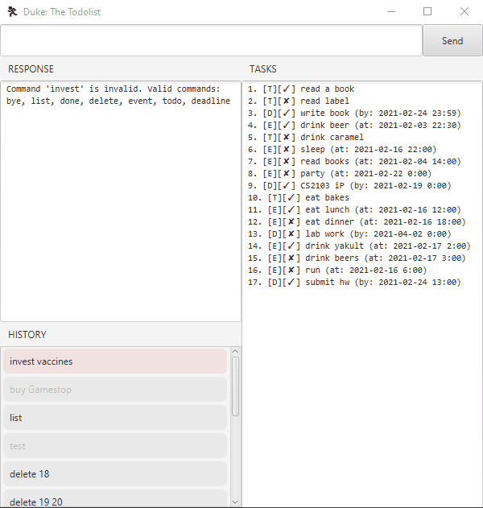
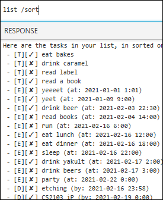

# Duke

A very basic todo manager that's a wee bit utilitarian, without pretending you're talking to a bot.  
Also a very uninspired name, considering I leeched this off the original as a fork.

Disclaimer: Done as part of [NUS CS2103 Software Engineering](https://nus-cs2103-ay2021s2.github.io/website/admin/index.html)
project assignment.  
**Prerequisite: Java 11**

This task manager allows you to add three types of tasks:

1. Todos with simple task description
1. Events with description and event time
1. Deadlines with description and due date

All tasks are always displayed on the right panel for easy viewing, which is
essentially `list` but on standby 24/7.
If this isn't enough, try using the `list /sort` utility that orders all tasks
by task type and timing.

To cherry-pick, how about a `find` utility to sieve matching descriptions across
all tasks? Even supports partial searching and date range based searches.

Once tasks are done (or dusted, even), feel free to swipe them off the list using `delete`,
or go the non-destructive route by simply marking as `done`. If you're super productive checking
items off even before having them on the list, you can mark tasks as `/done` immediately
as well. How cool is that?

You can leave the app by clicking on the close button, but of course, a `bye` command
with the exact same functionality is supplied for those lazy - to use a mouse. Other fast-quit
alternatives include `Ctrl-Q` and `Ctrl-H`, if these are available on your system as well.

## Command syntax

Terms in `SCREAMING_SNAKE_CASE` should be supplied by you, the user.
You wouldn't want a mysterious albeit charming task called `TASK_NAME`, do you?

| Command | Example |
|---|---|
| `todo TASK_NAME [/done]` | `todo eat food`, `todo drink fish /done` |
| `event TASK_NAME /at TIME [/done]` | `event nom /at 14:30`, `event nom /at 16 Jan`, etc. |
| `deadline TASK_NAME /by TIME [/done]` | `deadline chew this /by 2021-02-16 14:30`, etc. |
| `list [/sort]` | `list`, `list /sort` |
| `find [QUERY] [/from TIME] [/to TIME]` | `find books /from Jan 19`, etc. |
| `done INDEX [INDEX ...]` | `done 1 7 8 3` |
| `delete INDEX [INDEX ...]` | `delete 1 4 5` |
| `bye` | `bye` |

## Usage of key features

### `find` - Find tasks

Filter tasks that match specific search queries or date range queries.

Example of usage:

`find meet /from 17 Feb`

Expected outcome:

    Found 3 task(s) matching query / date range:
      from:  Wed 12:00 AM, 17 Feb 2021
      query: 'meet'
    
    2. [D][✓] group meeting (by: 2021-02-17 14:00)
    3. [E][✓] meet friendo (at: 2021-02-19 18:00)
    5. [E][✓] meet army friends (at: 2021-02-22 08:25)

------

### `list` - List tasks

Prints out the list of tasks, with optional `/sort` parameter to print in sorted
(alphabetical and chronological) order.

Example of usage:

`list /sort`

Expected outcome:

    Here are the tasks in your list, in sorted order:
    - [T][✓] eat bakes
    - [T][✓] drink caramel
    - [T][✘] read label
    - [T][✓] read a book
    - [E][✓] yeeeeeeeet (at: 2021-01-01 1:01)
    - [E][✓] drink beer (at: 2021-02-03 22:30)
    - [E][✘] read books (at: 2021-02-04 14:00)
    - [E][✘] run (at: 2021-02-16 6:00)
    - [E][✓] eat lunch (at: 2021-02-16 12:00)
    - [E][✓] eat dinner (at: 2021-02-16 18:00)
    - [E][✓] sleep (at: 2021-02-16 22:00)
    - [E][✓] drink yakult (at: 2021-02-17 2:00)
    - [E][✓] drink beers (at: 2021-02-17 3:00)
    - [E][✘] party (at: 2021-02-22 0:00)
    - [D][✓] etching (by: 2021-02-16 23:59)
    - [D][✓] CS2103 iP (by: 2021-02-19 0:00)
    - [D][✓] submit hw (by: 2021-02-24 13:00)
    - [D][✓] write book (by: 2021-02-24 23:59)
    - [D][✘] lab work (by: 2021-04-02 0:00)

------

### `done` - Mark tasks as done

Mark tasks as done (which rewards you with a nice unicode tick).
Tasks specified by the index number in the task list.
Similar to `delete` syntax.

Example of usage:

`done 2 3`

Expected outcome:

    Nice! I've marked these tasks as done:
      [T][✓] read label
      [D][✓] write book (by: 2021-02-24 23:59)

------

## Other easter eggs

1. Click on the boxes containing your past inputs to copy them directly
   into the input box.
1. Input is insensitive to extraneous duplicate whitespaces.
1. The `TIME` format takes in a relatively larger variety of datetime formats,
   including `2021-01-13 13:40` (ISO-like format), `Jan 13` (American-style),
   `13 Jan` (British-style), `13/1/2021` (old school), etc.
   Description of exact parsing rules is in the Java documentation.
1. Note, however, a bug in the `java.time.LocalDateTime` parser that matches invalid dates (e.g.
   31 Feb) by mapping it to the nearest valid date. Make sure the dates you supply are correct in the first place!
1. Options are prefixed with the `/` symbol. But this program also knows to parse dates containing `/`.
1. Text boxes are especially allowed to be highlightable, in the off chance you want to copy it somewhere else...
1. ...and exercise an undocumented `delete /all` nuclear option, but you'll never want to stop using
   this cute little app, won't you?
