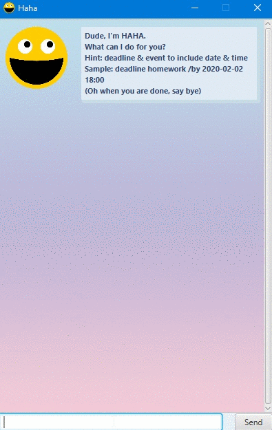
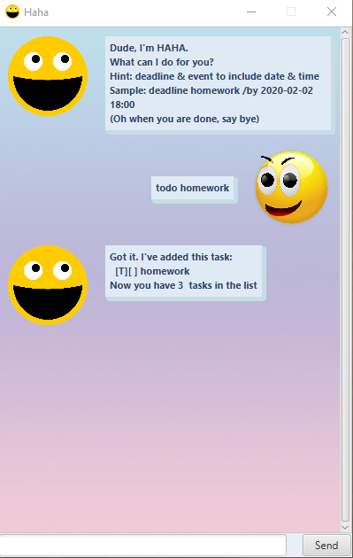
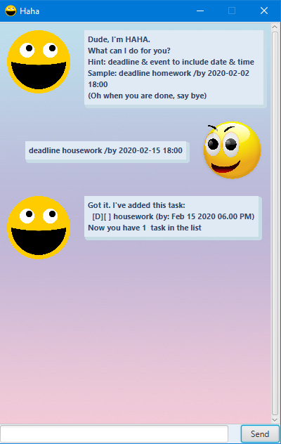
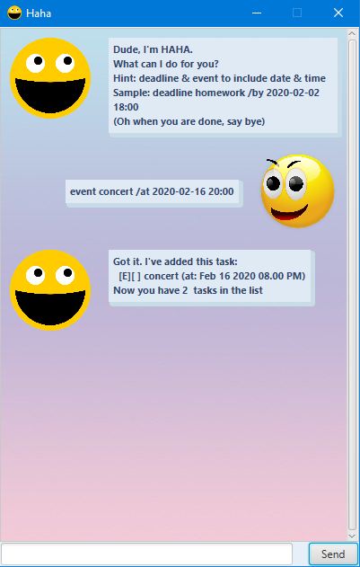
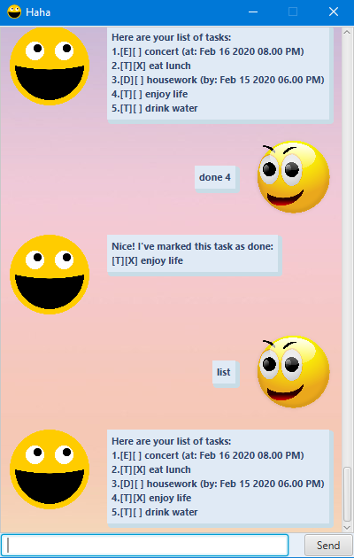
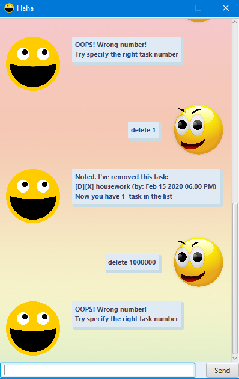
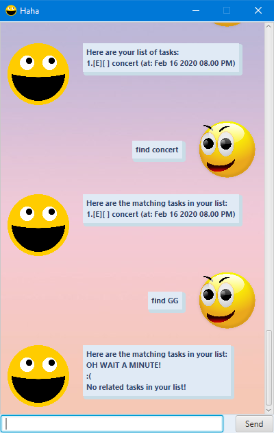

# Haha

## Features 
- Add a number of tasks (Todos, Events & Deadlines)
- Display status of saved tasks
- Mark tasks as completed
- Delete selected task
- Find task by keyword

## Usage

### `todo XXX` - Add a Todo

A new todo with description(XXX) will be added.

Duplicated todos will not be allowed and will result in an error warning.

Example of usage: 

`todo homework`

Sample screenshot:

### `deadline XXX /by YYY ZZZ` - Add a Deadline

A new deadline with description(XXX), date(YYY) & time(ZZZ) will be added.

Duplicated deadlines will not be allowed and will result in an error warning.

Example of usage: 

`deadline housework /by 2020-02-15 18:00`

Sample screenshot:

### `event XXX /at YYY ZZZ` - Add an Event

A new event with description(XXX), date(YYY) & time(ZZZ) will be added.

Duplicated events will not be allowed and will result in an error warning.

Example of usage: 

`event concert /at 2020-02-16 20:00`

Sample screenshot:

### `list` - List all saved tasks

Display all saved tasks in a list.

Example of usage: 

`list`

Sample screenshot:

### `done XXX` - Mark a task as completed

The task at the index(XXX) will be marked as done.

Index starts from 1 and out of range indexes will result in an error warning.

Example of usage: 

`done 1`

Sample screenshot:

### `delete XXX` - Delete a task

The task at the index(XXX) will be deleted.

Index starts from 1 and out of range indexes will result in an error warning.

Example of usage: 

`delete 1`

Sample screenshot:

### `find XXX` - Find tasks containing XXX in its description

Tasks with descriptions including the specified keyword(XXX) will be listed.

When there are no related tasks, Haha will respond appropriately.

Example of usage: 

`find concert`

Sample screenshot:

### `bye` - Exit application

The application will exit gracefully.

Example of usage: 

`bye`
