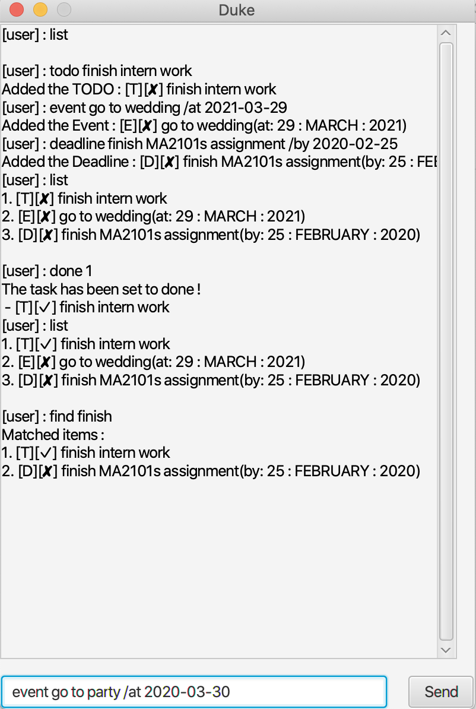

# Duke Application
Duke, a Personal Assistant Chatbot that helps a person to keep track of various tasks (i.e. To Do List, Deadlines and Events).
1. Ensure you have Java 11 or above installed in your Computer.
1. Download the latest Duke.jar from here.
1. Copy the file to the folder you want to use as the home folder for your Duke App.
1. Double-click the file to start the app. 

1. Type the command in the command box and press Enter to execute it.
Some example commands you can try:
1. Refer to the [Features Page](https://github.com/glatiuden/ip/tree/master/docs#features) for details of each command.

## Command summary

Action | Format
--------|------------------
**todo** | `todo DESCRIPTION`
**deadline** | `deadline DESCRIPTION /by DATE[TIME]`
**event** | `event DESCRIPTION /at DATE[TIME]`
**list** | `list [DATE]`
**find** | `find KEYWORD [MORE KEYWORDS]`
**delete** | `done INDEX` or `done all`
**done** | `delete INDEX` or `delete all`
**bye** | `bye`
