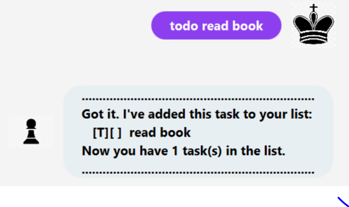

<h1 align="center">Duke</h1>

    

 
## About

Duke is a desktop app to track and manage tasks easily. Built
for [CS2103T: Software Engineering Module](https://nus-cs2103-ay2021s2.github.io/website/admin/index.html).

## Features

### 1. Add Tasks

Add different types of tasks to a task list to easily track them. Task types:

- Todos - Tasks with no completion date
- Events - Tasks to be completed **on** a certain dare
- Deadline - Tasks to be completed **by** a cetain date

### 2. View Tasks

View all the tasks in the task list.

### 3. Mark as Completed

Mark a task as completed based on the task number.

### 4. Delete Tasks

Remove tasks from the task list once tracking is not required.

### 5. Sort Tasks

Sort the task list alphabetically based on the task description.

### 6. Find Tasks

Search for tasks from the task list based on a keyword.

## Usage

|      Feature      |              Command Format               |               Example                | Expected Outcome             |
|:-----------------:|:-----------------------------------------:|:------------------------------------:|:----------------------------:|
|   Add Todo Task   |            `todo <description>`           |           `todo read book`           ||
|   Add Event Task  |   `event <description> /at <YYYY-MM-DD>`  |    `event seminar /at 2021-03-04`    ||
| Add Deadline Task | `deadline <description> /at <YYYY-MM-DD>` | `deadline assignment /by 2021-02-28` ||
|     View Tasks    |                   `list`                  |                `list`                ||
| Mark as Completed |            `done <task_number>`           |               `done 1`               ||
|    Delete Tasks   |           `delete <task_number>`          |              `delete 2`              ||
|     Sort Tasks    |                   `sort`                  |                `sort`                ||
|     Find Tasks    |              `find <keyword>`             |              `find book`             ||

## Setting up in Intellij

Prerequisites: JDK 11, update Intellij to the most recent version.

1. Open Intellij (if you are not in the welcome screen, click `File` > `Close Project` to close the existing project
   dialog first)
1. Set up the correct JDK version, as follows:
    1. Click `Configure` > `Structure for New Projects` and then `Project Settings` > `Project` > `Project SDK`
    1. If JDK 11 is listed in the drop down, select it. If it is not, click `New...` and select the directory where you
       installed JDK 11
    1. Click `OK`
1. Import the project into Intellij as follows:
    1. Click `Open or Import`.
    1. Select the project directory, and click `OK`
    1. If there are any further prompts, accept the defaults.
1. After the importing is complete, locate the `src/main/java/Launcher.java` file, right-click it, and
   choose `Run Launcher.main()`. If the setup is correct, the GUI should open.

