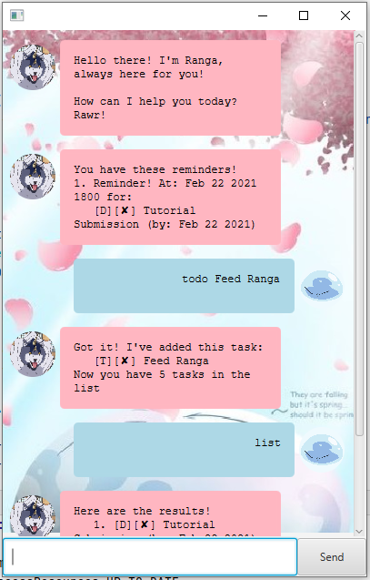

# Welcome to Ranga! Rawrz! 

Hello! I am Ranga! Your personal tasks manager chatbot! I can keep track of your ToDos, Deadlines, and Events! Rawrz!

## Quickstart
1. Ensure you have Java 11 or above installed in your Computer.
2. Download the latest jar from here:
3. Copy the file to the folder you want to use as the home folder for Ranga.
4. Double-click the file to start the app. 
5. Type in your commands and hit enter.
6. Type `help` for different commands. Refer to the functions listed below for more details!

---

### Types of Tasks
I can record 3 different types of tasks for you:
1. Todo
2. Deadline
3. Event

---
### Bye `bye`
Quit the application.

Format: `bye`

Example: `bye`

### Help `help`
Shows available commands and their formats

Format: `help`

---

## Add Tasks
### Add ToDo `todo`
Add a todo task.

Format: `todo DESCRIPTION`

Example: `todo Run with Ranga`

### Add Deadline `deadline`
Add a deadline task.

Format: `deadline DESCRIPTION /by DATE`

Example: `deadline Feed Ranga /by 22 Feb 2021 1800`

### Add Event `event`
Add a event task.

Format: `event DESCRIPTION /at DATE`

Example: `event Ranga's Birthday /by 23 Feb 2021`

---

## Modify Tasks
### Mark as Done `done`
Marks a task as done.

Format: `done TASK_ID`

Example: `done 1`

### Add a Reminder to a Task `Remind`
Adds a Reminder to a task for a specific date. Reminders show when I start up!

Format: `remind TASK_ID /on DATE`

Example: `remind 1 /on 25/02/21`

### Remove a Task
Removes a stored task.

Format: `remove TASK_ID`

Example: `remove 1`

---

## See Tasks
### List tasks `list`
Shows the stored tasks.

Format: `list`

Example: `list`

### List Reminders - `reminders`
Shows a list of all stored reminders.

Format: `reminders`

Example: `reminders`

### Find Tasks - `find`
Find a task by its description.

Format: `find SEARCH_STRING`

Example: `find Birthday`

---

# Code Summary

| Function      | Format                              |
| ------------- | ----------------------------------- |
| ToDo          | `todo` `DESCRIPTION`                |
| Deadline      | `deadline` `DESCRIPTION` `/by DATE` |
| Event         | `event` `DESCRIPTION` `/at DATE`    |
| Remind        | `remind` `TASK_ID` `/on DATE`       |
| Done          | `done` `TASK_ID`                    |
| Remove        | `remove` `TASK_ID`                  |
| List          | `list`                              |
| find          | `find SEARCH_STRING`                |
| Reminder      | `reminders`                         |
| Help          | `help`                              |
| bye           | `bye`                               |

---
> Rawr!
