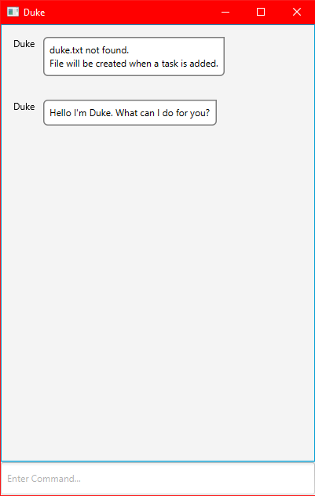
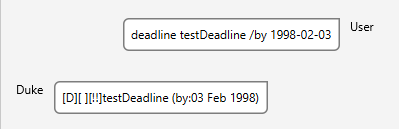
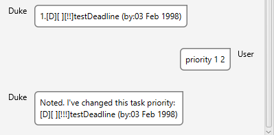

# User Guide
Duke is a **desktop application for task management through a   
Command Line Interface** with minor graphic user interface for better
readability.

- [Quick start](#quick-start)
- [Task Types](#task-types)
- [Features](#features)
    - [Adding a task](#adding-tasks-eventdeadlinetodo)
    - [Listing all tasks](#listing-all-tasks-list)
    - [Deleting a task](#deleting-a-task-delete)
    - [Completing a task](#completing-a-task-done)
    - [Setting a task priority](#setting-a-task-priority-priority)
    - [Exiting the application](#exiting-the-application-bye)

  
## Quick start
1. Ensure you have Java `11` installed.
2. Download the latest `duke.jar`.
3. Place the file to the folder you want to use the as the _home folder_ 
4. Double click the `duke.jar` file.
    - If you had not associated jar files with java, ensure you open the file using your java executable.
5. The GUI will now be shown below.
   
   

## Task Types
The app supports the following task types, which will be printed as,

1. Events: `[E][DONE][PRIORITY] EVENT_DESC (at: DATE)`
2. Deadlines: `[D][DONE][PRIORITY] DEADLINE_DESC (by: DATE)`
3. To Dos: `[T][DONE][PRIORITY] TODO_DESC`

`[DONE]` will either be displayed as `[ ]` if it is not done or `[X]`if it is.  
`[PRIORITY]` will be displayed as `[!]`,`[!!]` or `[!!!]`.
## Features

### Adding tasks: `event/deadline/todo`
Adds a task i.e event/deadline/todo to the task list.

Format:
1. Event: `event NAME /at DATE`
2. Deadline: `deadline NAME /by DATE`
3. To Do: `todo NAME`

**Tip**: You can type in the format `YYYY-MM-DD` for the `DATE` field, and the application will parse it
into its proper date. Otherwise, it will just show what you just typed in the `DATE` field.

### Listing all tasks: `list`
Shows a list of all the tasks.  

Format: `list`

### Deleting a task: `delete`
Deletes a task by its given index number.

Format: `delete INDEX_NUMBER`

### Completing a task: `done`
Setting a task as completed given its index number.

Format: `done INDEX_NUMBER`

### Setting a task priority: `priority`
Setting a task priority given its index number.

Format: `priority INDEX_NUMBER NEW_PRIORITY`  
where `NEW_PRIORITY` is `0-2` where `0` is the lowest priority and `2` is highest.  
`0` will be displayed as `!`, `1` as `!!` and `2` as `!!!`.

### Exiting the application: `bye`
Exit application.

Format: `bye`