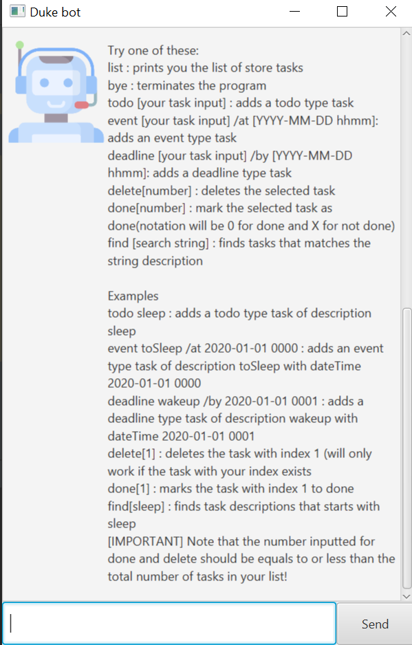

# User Guide
Duke bot is a chat bot designed to be used via a command line interface(CLI) with the benefits of using a graphical user interface(GUI). 

## Features 
>list : prints you the list of store tasks 
bye : terminates the program 
help : prints descriptions and samples of each feature 
todo [your task input] : adds a todo type task 
event [your task input] /at [YYYY-MM-DD hhmm]: adds an event type task 
deadline [your task input] /by [YYYY-MM-DD hhmm]: adds a deadline type task 
delete[number] : deletes the selected task 
done[number] : make the selected task done 
find [search string] : finds tasks that matches the string description 

### `list` - prints you the list of store tasks 

Example of usage: 

`list`

Expected outcome:

`These are the tasks in your list:
 1.[T] [X] sample`

### `bye` - terminates the program

Example of usage: 

`bye`

Expected outcome:

`Goodbye!`

### `help` - prints descriptions and samples of each feature

Example of usage: 

`help`

Expected outcome:

### `todo` - adds a todo type task

Example of usage: 

`todo sleep`

Expected outcome:

>Added the following task:  
> [T][X] sleep 
>You now have 1 tasks in your list

### `event` - adds an event type task

Example of usage: 

`event tosleep /at 2020-01-01 1111`

Expected outcome:

>Added the following task: 
> [E][X] tosleep 2020-01-01 1111
>You now have 1 tasks in your list

### `deadline` - adds a deadline type task

Example of usage: 

`deadline wakeup /by 2020-01-01 1111`

Expected outcome:

>Added the following task: 
> [D][X] wakeup 2020-01-01 1111
>You now have 1 tasks in your list

### `delete` - deletes the selected task

Example of usage: 

`delete 1`

Expected outcome:

>The following task has been removed: 
> [T][X] sample
>You now have 0 tasks in your list

### `done` - make the selected task done

Describe action and its outcome.

Example of usage: 

`done 1`

Expected outcome:

>Following task has been marked done: 
>[T][O] sample

### `find` - finds tasks that matches the string description

Example of usage: 

`find sample`

Expected outcome:

>Here are the tasks you asked for: 
>1. [T][X] sample

