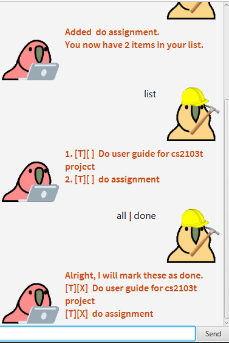
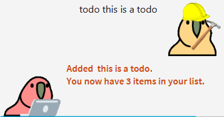
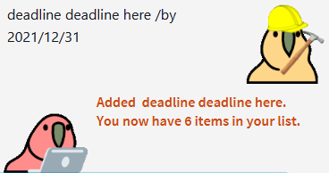
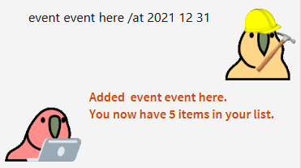
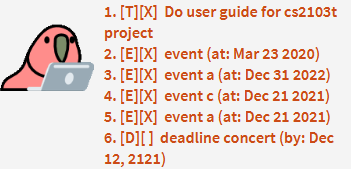
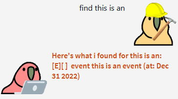
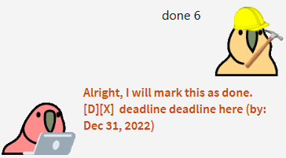
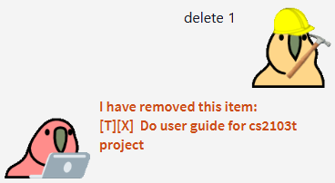
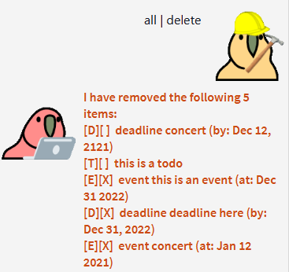
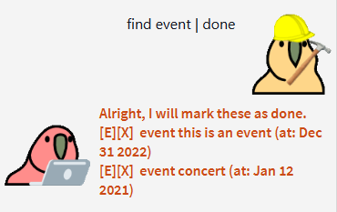

# User Guide

Duke Task Manager is a small desktop application that allows one to keep track of todos, deadlines, and events. 



## Features 

* Keeping track of tasks
* Saving all tasks to a file on the computer automatically
* Listing all tasks
* Deleting tasks
* Marking tasks as done
* Finding tasks with keywords
* Delete multiple tasks at once
* Marking multiple tasks at once

## Usage

All tasks saved are displayed in a simple to remember format: 

*index*. [*type*][*done*]  *description* *(time)*

Field | Meaning
-----|--------
***index*** |Index of that item in the task list
***type*** |Type of task:<br />**T**: Todo<br />**D**: Deadline<br />**E**: Event
***done*** |Whether task is done, a done task is marked with X
***description*** |Description for the task
***time*** |*Only applicable to deadlines and events*<br />Deadline or event timing

### Adding task
To add a task, follow the following formats: 

#### Add todo: 
```
todo [description]
```
E.g. ```todo do work``` adds a new todo task with description **do work**. 



#### Add deadline: 
```
deadline [description] /by [date]
```
E.g. ```deadline finish assignment /by 2021-12-21``` adds a new deadline task with description **finish assignment** with deadline by **21 Dec 2021**. 



#### Add event: 
```
event [description] /at [date]
```
E.g. ```event concert /at 2021 12 21``` adds a new event task with description **finish assignment** on **21 Dec 2021**.



##### For events and deadlines, the following date formats are allowed:
* year-month-date, e.g. 2021-1-12
* year month date, e.g. 2021 1 12
* year/month/date, e.g. 2021/1/12


Note that month has to be in **number**, e.g. Jun is not accepted but 7 is. 

### Listing all tasks
Either
```
list
```
or
``` 
all
```
 You will be able to see a list of all saved tasks: 
 
 

### Searching
``` 
find [keyword]
```
where keyword is the content you wish to search for. 



### Setting a task to done
``` 
 done [index]
```
where index is the index of the task you wish to set to done. 



### Deleting tasks
```
delete [index]
```
where index is the index of the task you wish to remove. 



### Mass operations
Sometimes, you may want to set multiple tasks to done or remove multiple items at once. For such cases, you can use **|**, also known as the **pipe**. 

To use pipes: 
``` 
[filter] | [action]
``` 

filter is what you use to select the tasks you want, and action is what you want to do with all those tasks. 

```[filter]``` supports ```list```, ```all```, and ```find```.
 
```[action]``` supports ```done``` and ```delete```. 

For example: 

 

Here all tasks are deleted.

 

Here all events are set to done.  

### Exit Duke
To exit, simply use: 
``` 
bye
```
 

## Credits
Images from [Cult of the Party Parrot](https://cultofthepartyparrot.com/). 

Font used are Ubuntu and Source Code Pro, both from [Google Fonts](https://fonts.google.com/). 
