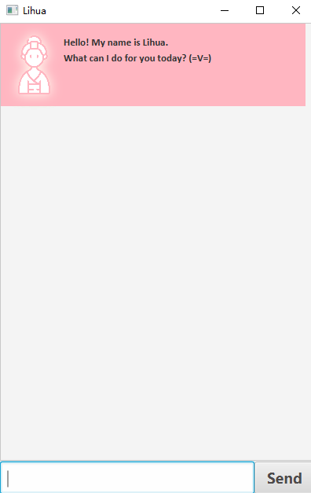
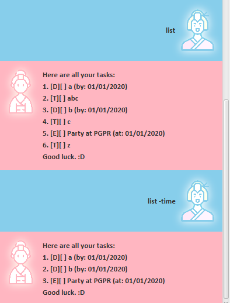
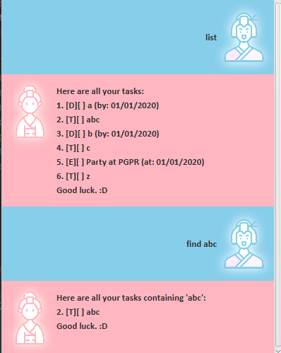

<!-- https://se-education.org/addressbook-level3/UserGuide.html -->
# User Guide for Lihua

**Lihua** is a friendly **task management bot** residing in a **desktop application**.
The bot is optimized for use via a **Command Line Interface** (CLI) while still having the benefit of
a Graphical User Interface (GUI). If you can type fast, Lihua can get your daily task management job done
faster than traditional GUI apps.
- [Quick start](#quick-start)
- [Features](#features)
  - [Viewing Help](#viewing-help-help): `help`
  - [Adding a task](#adding-a-task):
    - [Adding a todo](#adding-a-todo-todo): `todo`
    - [Adding a deadline](#adding-a-deadline-deadline): `deadline`
    - [Adding an event](#adding-an-event-event): `event`
  - [Listing tasks](#listing-tasks-list): `list`
  - [Finding tasks by key word](#finding-tasks-by-key-word-find): `find`
  - [Marking a task as done](#marking-a-task-as-done-done): `done`
  - [Deleting a task](#deleting-a-task-delete): `delete`
  - [Exiting the program](#exiting-the-program-bye): `bye`
  - [Saving the data](#saving-the-data)
  - [Editing the data file](#editing-the-data-file)
- [FAQ](#faq)
- [Command summary](#command-summary)
    
## Quick start
1. Ensure you have `Java 11` or above installed in your computer.
2. Download the latest `Lihua.jar` from [here](https://github.com/Cheng20010201/ip/releases/tag/v0.2).
3. Copy the file you downloaded in step 2 to the folder you want to use as the *home folder* for Lihua. 
   E.g. `~/Desktop/Lihua/Lihua.jar`
4. Open the terminal window, make sure your present working directory is the *home folder* you created in step 3.
5. Run `java -jar Lihua.jar`. The GUI similar to the below should appear in a few seconds.
   

6. Type the command in the command box and press Enter to execute it. 
   e.g. typing `help` and pressing Enter will let Lihua list help information for all tasks.
   
   Some example commands you can try:
   * `list`: Lists all tasks.
   * `todo Do CS2103T IP tasks.`: Adds a `todo` task named "Do CS2103T IP tasks.".
   * `done 1`: Marks the first task in your list as done.
   * `delete 1`: Deletes the first task in your list.
   * `bye`: Exits the application.
7. Refer to the [Features](#features) below for details of each command.

## Features

Notes about the features:
- Words in `UPPER_CASE` are the parameters to be supplied by the user.
  e.g. in `todo TASKNAME`, `TASKNAME` is a parameter which can be used as `todo Do homework`.
- Items in square brackets are optional.
  e.g. `list [-time]` can be used as `list` or as `list -time`.
- Command keywords do not distinguish lower case and upper case.
  e.g. `list` is equivalent to `LiSt`.
- Extraneous parameters for commands that do not take in parameters 
  (such as `help` and `exit`) will be ignored.
- Tasks will be stored based on their alphabetic order in the list, from the smallest to the largest. 

### Viewing Help: `help`
Shows a message giving detailed explanation of available commands.

Format: `help`.

### Adding a task
Adds a task to the Lihua's task list. 
More specifically, there are 3 types of tasks you can add, as specified below.

#### Adding a todo: `todo`
Adds a `todo` task to Lihua. A `todo` task is a task with only a task name.

Format: `todo TASKNAME`.

Example: `todo Do homework`.

#### Adding a deadline: `deadline`
Adds a `deadline` task to Lihua. A `deadline` task is a task with a task name and a task deadline date.

Format: `deadline TASKNAME /by YYYY-MM-DD`.

Example: `deadline Submit IP /by 2021-02-19`.

Notes:
- The date format must be `YYYY-MM-DD`.
- The indicator ` /by ` cannot be omitted nor replaced.

#### Adding an event: `event`
Adds an `event` task to Lihua. An `event` task is a task with a task name and a task commencement date.

Format: `event TASKNAME /at YYYY-MM-DD`.

Example: `event Party for PGPR /at 2020-02-23`.

Notes:
- The date format must be `YYYY-MM-DD`.
- The indicator ` /at ` cannot be omitted nor replaced.

### Listing tasks: `list`
Lists all tasks stored in Lihua.

Format: `list [-time]`.

Example:

Notes:
- If `-time` is not applied, Lihua will list all current tasks in alphabetic order of task names.
- If `-time` is applied, Lihua will list all current tasks with date information in chronological order.
If two tasks are on the same date, then the relative ordering of the tasks will not change, 
  which is specified in the whole task list.

### Finding tasks by key word: `find`
Finds all tasks containing the key word specified.

Format: `find KEYWORDS`.

Example: `find abc`.

Notes:
- Only one keyword is allowed. Extra parameters will be ignored.
e.g. `find abc a`, `a` will be ignored here.
- The search is not case-sensitive.
e.g. `find A` is equivalent to `find a`.
- The key word only needs to be part of the task name. It does not need to be the whole task name.
e.g. `find a` can return you a `todo` task named `abc`.

### Marking a task as done: `done`
Marks a task as done.

Format: `done TASKINDEX`.

Example: `done 1`.

Notes:
- The `TASKINDEX` refers to the index number shown in the displayed task list by calling `list`.
- The `TASKINDEX` you can specify is **an integer from 1 to total number tasks, inclusive**. 

### Deleting a task: `delete`
Deletes a task.

Format: `delete TASKINDEX`.

Example: `delete 1`.

Notes:
- The `TASKINDEX` refers to the index number shown in the displayed task list by calling `list`.
- The `TASKINDEX` you can specify is **an integer from 1 to total number tasks, inclusive**.

### Exiting the program: `bye`
Exits the application.

Format: `bye`.

### Saving the data
Lihua's data is saved in the hard disk automatically after any command that changes the data. 
There is no need to save manually.

### Editing the data file
Lihua's data is saved as a JSON file `[JAR file location]/data/lihua.json`. 
Advanced users are welcome to update data directly by editing that data file.

## FAQ
**Q**: How do I transfer my data to another Computer?

**A**: Install the app in the other computer and overwrite the empty data file 
it creates with the file that contains the data of your previous Lihua *home folder*.

## Command Summary
| Command | Format | Example / Explanation |
| ------- | ------ | --------------------- |
| **bye** | `bye` | application exits |
| **deadline** | `deadline TASKNAME /by YYYY-MM-DD` | `deadline homework /by 2021-01-01` | 
| **delete** | `delete TASKINDEX` | `delete 1` |
| **done** | `done TASKINDEX` | `done 1` |
| **event** | `event TASKNAME /at YYYY-MM-DD` | `event party /at 2020-01-01` |
| **find** | `find abc` | tasks containing `abc` will be listed |
| **help** | `help` | help message for commands will be printed |
| **list** | `list [-time]` | tasks \[with date\] will be listed |
| **todo** | `todo TASKNAME` | `todo Eat` |
