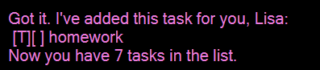
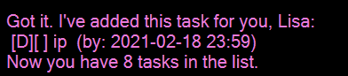
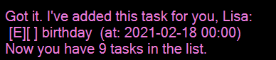

# User Guide for ChaeLisa

---

ChaeLisa is a **task management application** made for people who like command line interface to keep track of their tasks everyday. ChaeLisa allows people to execute task rapidly when they are familiar with the syntax of command line.
 
## Quick start

1. Ensure Java `11` or above installed in your Computer

1. Download the `ChaeLisa.jar`.

1. Open cmd in the downloaded folder of `.jar` file and run the command `java -jar ChaeLisa.jar`.

1. Type command in the command box and press Enter or press Send button to execute it.

1. The [Features](#Features) below shows details of each command function and how to use it.

## Features 

### Adding a ToDo: `todo`

Adds a ToDo to the list.

Format: `todo [TASKNAME]`

Examples:
* `todo homework`

Expected outcome:

The returns will be like this:

### Adding a Deadline: `deadline`

Adds a deadline to the list.

Format: `deadline [TASKNAME] /by YYYY-MM-DD HH:MM`

Examples:
* `deadline ip /by 2021-02-18 23:59`

Expected outcome:

The returns will be like this:

### Adding an Event: `event`

Adds an event to the list.

Format: `event [TASKNAME] /at YYYY-MM-DD HH:MM`

Examples:
* `event birthday /at 2021-02-18 00:00`

Expected outcome:

The returns will be like this:

### Listing all task: `list`

Shows a list of all the task in the list.

Format: `list`

Expected outcome:

`Here are the task in your list, Lisa:`

Then come with all tasks in the list.

### Finding task using keywords: `find`

Finds all tasks that matches the given keywords.

Format: `find [KEYWORD]`

Examples:
* `find ip`

Expected outcome:

`Here are the matching tasks, Lisa`

Then come with all tasks that contains the phrase **ip**.

### Marking a task as done: `done`

Marks a task in the list as done.

Format: `done [INDEX]`
* The index is based on the list when you command [list] (#Listing all task: `list`)

Examples:
* `done 1` Marks the first task in the list as done. 

Expected Outcome:  

`Nice! I've marked this task as done for you, Lisa:`  

Then come with the task that is marked as done.

### Deleting a task: `delete`

Deletes a task from the list.

Format: `delete [INDEX]`
* The index is based on the list when you command [list] (#Listing all task: `list`)

Examples:
* `delete 1` Deletes the first task on the list.

Expected Outcome:

`Noted. I've removed this task for you, Lisa:`

Then come with the task deleted.

### Showing all tasks of today: `myTaskToday`

Prints all tasks (Todo, Deadline, Event) you got in your list today.

Format: `myTaskToday`

Expected outcome:

`Here are the tasks today, Lisa:`

Then come with all the tasks today.

### Showing all tasks of today: `myTaskOn`

Prints all tasks (Deadline, Event) you got in your list on that day.

Format: `myTaskOn YYYY-MM-DD`

Examples:
* `myTaskOn 2021-02-18`

Expected outcome:

`Here are the tasks on 2021-02-18:`

Then come with all the tasks on that day.

### Showing all unfinished deadlines: `reminder`

Prints all deadlines that is upcoming and unfinished.

Format `reminder`

Expected outcome:

`Here are the upcoming deadlines, Lisa:`

### Exiting the program : `bye`

Exits the program.

Format: `bye`

