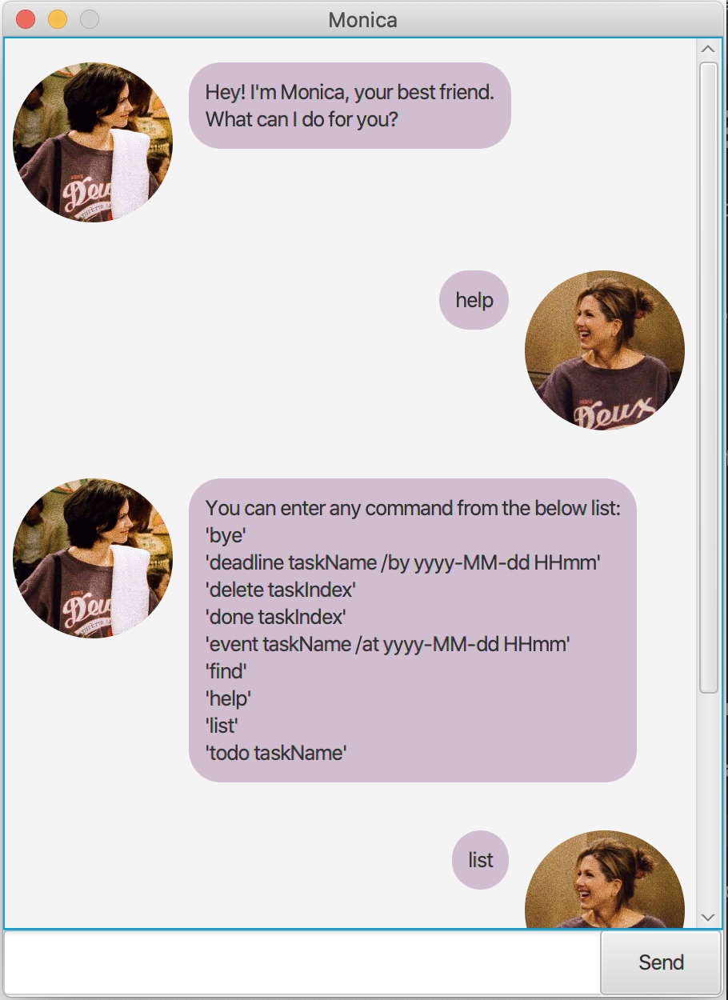

# User Guide of Monica
Monica is an application for task management.
## How can Monica help?
By you typing in simple command lines, Monica can interact with you, helping with store a new task, delete or retrieve your current tasks.


Here is what the application looks like:



## What can Monica do?

### Add task
Store a new task in any of the supported task types: `todo`, `event`, `deadline`.

### List tasks
Display all your current tasks.

### Mark as done
Mark a task as done.

### Delete task
Delete a task in your current task list.

### Find tasks
Find tasks with a keyword.

### Provide guidance
Help when you forget any command.


## How exactly can you use Monica?
Below are all the available commands you can type in and their usage descriptions.

### 1. `todo` - Add in a new todo task

Format:

`todo <name of todo task>`

Example: 

`todo run every day`

Message from Monica:

```
Got it. I've added this task:
 [T][✗] run every day
Now you have <number of tasks> tasks in the list.
```


### 2. `event` - Add in a new event task
Format:

`event <name of event task>`

Example:

`event CS2101 presentation /at 2021-03-01 1000 `

Message from Monica:

```
Got it. I've added this task:
 [E][✗] CS2101 presentation (at 10:00, 01 MAR 2021)
Now you have <number of tasks> tasks in the list.
```


### 3. `deadline` - Add in a new deadline task
Format:

`deadline <name of deadline task>`

Example:

`deadline CS2102 assignment 1 /by 2021-03-02 2359 `

Message from Monica:

```
Got it. I've added this task:
 [D][✗] CS2102 assignment 1 (by 23:59, 02 MAR 2021)
Now you have <number of tasks> tasks in the list.
```
### 4. `list` - List down current tasks
Format:

`list`

Example:

`list`

Message from Monica:

```
Here are the tasks in your list:
1.[T][✓] run every day
2.[E][✗] CS2101 presentation (at 10:00, 01 MAR 2021)
3.[D][✗] CS2102 assignment 1 (by 23:59, 02 MAR 2021)
```

### 5. `done` - Mark a task when it is done
Format:

`done <Index of the task>` 

Example:

`done 1`

Message from Monica:

```
Nice! I've marked this task as done:
[T][✓] run every day
```

### 6. `delete` - Delete a task from current tasks
Format:

`delete <Index of the task>`

Example:

`done 1`

Message from Monica:

```
Nice! I've removed this task:
 [T][✓] run every day
Now you have <number of tasks> tasks in the list.
```
### 7. `find` - Find tasks with a keyword
Format:

`find <keyword>`

Example:

`find assignment`

Message from Monica:

```
Here are the matching tasks in your list:
1.[D][✗] CS2102 assignment 1 (by 23:59, 02 MAR 2021)
```
### 8. `help` - Provide guidance in commands
Format:

`help`

Example:

`help`

Message from Monica:

```
You can enter any command from the below list:
'bye'
'deadline taskName /by yyyy-MM-dd HHmm'
'delete taskIndex'
'done taskIndex'
'event taskName /at yyyy-MM-dd HHmm'
'find'
'help'
'list'
'todo taskName'
```
## Author
Gu Yichen


