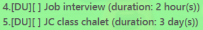
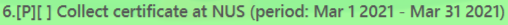

# User Guide
Popo is a desktop application for managing multiple types of task, and optimized for
use via a Command Line Interface (CLI) while still having the benefits of a
Graphical User Interface (GUI).

If you can type fast and need a personal assistant to keep track of lots of tasks,
Popo task manager is here to help you!

- Quick Start
- Types of Tasks
- Features
- FAQ
- Command Summary

## Quick Start
1. Ensure you have Java 11 or above installed.
2. Download the latest `popo.jar` [here](https://github.com/w2vgd/ip/releases).
3. Copy the file to the folder you want to use as the home folder for Popo Task Manager.
4. Double-click the jar file to start the app. The GUI similar to the below should appear in a few seconds. \
   (You may also specify your own data source file. Learn how to do so [here](#FAQ).)
   

## Types of Tasks
### Todo 
A normal task with only a name

### Deadline
A task with a name and a deadline date component \
(and an optional deadline time component)

### Event
A task with a name and a location description

### Duration
A task with a name and a time period

### Period
A task with a name and a starting and ending date

## Features
**Notes about the command format:**
- Words in between `<>` are the parameters to be supplied by the user. \
  E.g. In `todo <task_description`, `<task_description>` is a parameter which can
  be used as \
  `todo read book`.
- Items in square brackets are optional. \
  E.g. `deadline <task_description> /by dd/mm/yyyy [HHMM]` can be
  used as \
  `deadline assignment /by 1/3/2021 2359` or simply as 
  `deadline assignment /by 1/3/2021`.
- Extraneous parameters for commands will be ignored. \
  E.g. `list 123` will be interpreted as `list`.

### Adding a ToDo task: `todo`
Adds a ToDo task to the task list.

**Format:** `todo <task_description>` \
**Examples**:
- `todo Go CNY shopping`

### Adding a Deadline task: `deadline`
Adds a Deadline task to the task list.

**Format:** `deadline <task_description> /by dd/mm/yyyy [HHMM]` \
**Examples**:
- `deadline Assignment 1 /by 31/1/2021`
- `deadline Assignment 1 /by 31/1/2021 1800`
- `deadline Assignment 2 /by 28/10/2021, 2359`

### Adding a Event task: `event`
Adds an Event task to the task list.

**Format:** `event <task_description> /at <event_time>` \
**Examples**:
- `event Project Meeting /at NUS SoC COM1-0210`

### Adding a Duration task: `duration`
Adds a Duration task to the task list.

**Format 1:** `duration <task_description> /days <number>`    \
**Format 2:** `duration <task_description> /hours <number>`   \
**Format 3:** `duration <task_description> /minutes <number>` \
**Examples:**
- `duration Read report /days 3`
- `duration Practice exam /hours 2`
- `duration Eat lunch /minutes 30`

### Adding a Period task: `period`
Adds a Period task to the task list.

**Format:** `period <task_description> /start dd/mm/yyyy /end dd/mm/yyyy` \
**Examples:**
- `period Collect certificate at NUS /start 1/3/2021 /end 31/3/2021`

### Listing all tasks: `list`
Shows the full list of tasks.

**Format:** `list`

### Marking a task as completed: `done`
Marks the specified task in the task list as completed.

**Format:** `done <task_number>`
- Marks the task at the specified index as completed.
- The index refers to the index number of the task shown by the `list` command.

**Examples:**
- `done 2`

### Deleting a task: `delete`
Deletes the specified task from the task list.

**Format:** `delete <task_number>`
- Deletes the task at the specified index.
- The index refers to the index number of the task shown by the `list` command.

**Examples:**
- `delete 2`

### Finding a task by keyword: `find`
Finds all tasks whose names contain the given keyword(s).

**Format:** `find <keyword>`
- Only tasks with names containing the exact keyword(s) are returned.

**Examples:**
- `find book`
- `find read book`

### Viewing help: `help`
Displays all available commands and their usages.

**Format:** `help`

### Exiting the program: `bye`
Exits the program.

**Format:** `bye`

## FAQ
**Q**: What is the default data source file? \
**A**: From the base folder where you store the `popo.jar` file, the
default data source file can be found at `./data/popo.txt`.

**Q**: Is it possible to specify my own data source file? How do I specify my own data source file? \
**A**: Yes. To specify your own data source file, you have to run the jar file in your terminal or
command prompt with an additional argument indicating the file path of your own data
source file. The easiest way is to `cd` into the base directory containing the `popo.jar` file, and
run `java -jar popo.jar .\path\to\data\file\datasource.txt`. \
E.g. `java -jar popo.jar .\mydata\mytasks.txt`

**Q**: Do I have to pass in a specific date format? Which date formats are acceptable? \
**A**: Yes. We only accept the date format `dd/mm/yyyy` currently.

## Command Summary

Action | Format & Examples
--------|------------------
**Todo** | `todo <task_description>`   E.g. `todo Go CNY shopping`
**Deadline** | `deadline <task_description> /by dd/mm/yyyy [HHMM]`   E.g. `deadline Assignment 1 /by 31/1/2021 1800`
**Event** | `event <task_description> /at <event_time>`   E.g. `event Project Meeting /at NUS SoC COM1-0210`
**Duration** | `duration <task_description> /days <number>`   `duration <task_description> /hours <number>`   `duration <task_description> /minutes <number>`   E.g.`duration Practice exam /hours 2`
**Period** | `period <task_description> /start dd/mm/yyyy /end dd/mm/yyyy`  E.g. `period Collect certificate at NUS /start 1/3/2021 /end 31/3/2021`
**List** | `list`
**Done** | `done <task_number>`  E.g. `done 2`
**Delete** | `delete <task_number>`  E.g. `delete 2`
**Find** | `find <keyword>`  E.g. `find book`
**Help** | `help`
**Exit** | `bye`
