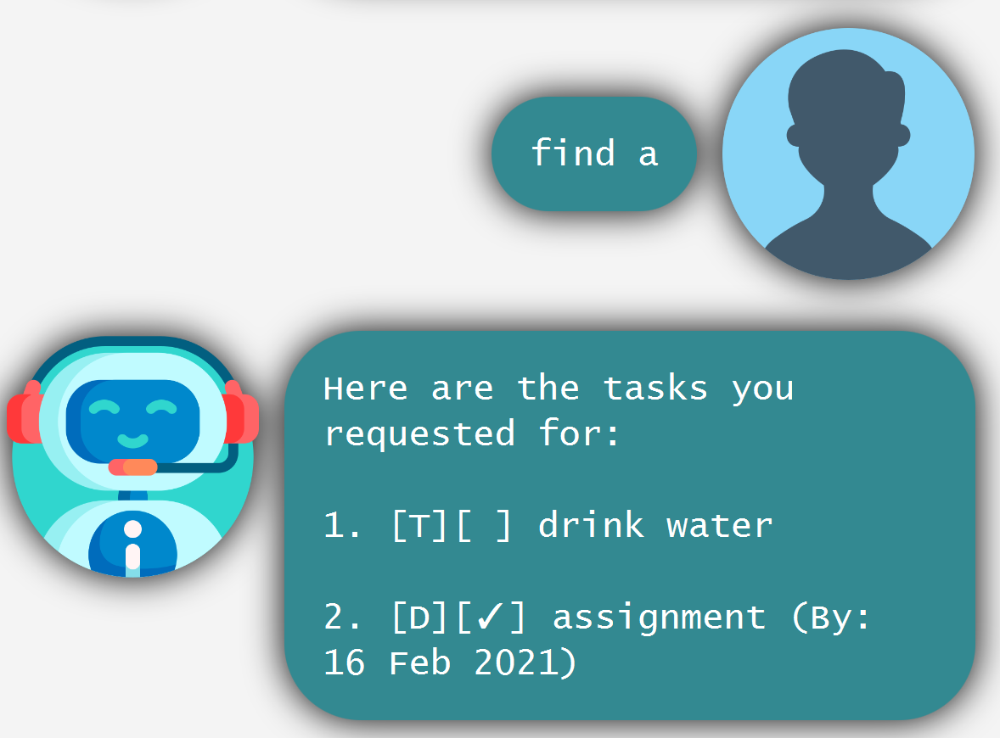
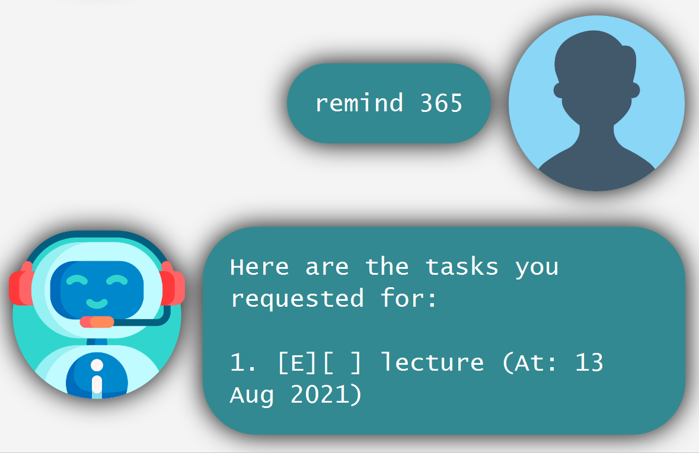

# User Guide

Duke is a desktop app for managing tasks using Command Line Interface (CLI).

--------------------------------------------------------------------------------------------------------------------

## Quick start

1. Ensure you have Java `11` or above installed in your Computer.

1. Download the latest `duke.jar` from [here](https://github.com/Ellevy/ip/releases/tag/A-Release).

1. Copy the file to the folder you want to use as the _home folder_ for your Duke.

1. Double-click the file to start the app. The GUI similar to the below should appear in a few seconds. 
   Note how the app contains some sample data. 
   

1. Type the command in the command box and press Enter to execute it. 
    
   Some example commands you can try:

    * **`list`** : Lists all tasks.

    * **`todo`**`drink water` : Adds a todo task to drink water.

    * **`done`**`1` : Marks the 1st task shown in the current list as done.

    * **`delete`**`1` : Deletes the 1st task shown in the current list.
    
    * **`bye`** : Exits the app.

1. Refer to the [Features](#features) below for details of each command.

--------------------------------------------------------------------------------------------------------------------

## Features 

**Notes about the command format** 

* Words in `UPPER_CASE` are the parameters to be supplied by the user. 
  e.g. in `todo DESCRIPTION`, `DESCRIPTION` is a parameter which can be used as `add drink water`.

* When `DESCRIPTION` is used as a parameter to be supplied by the user, the `DESCRIPTION` cannot contain `|`.

* When `DATE` is used as a parameter to be supplied by the user, the only format accepted is `yyyy-mm-dd`.
  e.g. in `deadline DESCRIPTION /by DATE`, `DATE` is specified in `yyyy-mm-dd` format which can be used as
  `deadline assignment /by 2021-02-16`.

* Items in square brackets are optional. 
  e.g. `remind [DAYS]` can be used as `remind` or as `remind 3`.
  

### Adding a todo task: `todo`
Adds a todo task to Duke.

Format: `todo DESCRIPTION`

Examples:
* `todo drink water`
* `todo tutorial`

### Adding a deadline task: `deadline`
Adds a deadline task to Duke.

Format: `deadline DESCRIPTION /by DATE`

Examples:
* `deadline assignment /by 2021-02-16`

### Adding an event task: `event`
Adds an event task to Duke.

Format: `event DESCRIPTION /at DATE`

Examples:
* `event meeting /at 2020-01-01`

### Marking task as done : `done`

Marks the specified task from Duke as done.

Format: `done INDEX`

* Marks the task at the specified `INDEX` as done.
* The index refers to the index number shown in the displayed task list.
* The index **must be a valid positive integer** 1, 2, 3, …​

Examples:
* `list` followed by `done 2` marks the 2nd task in Duke as done.

### Deleting a task : `delete`

Deletes the specified task from Duke.

Format: `delete INDEX`

* Deletes the task at the specified `INDEX`.
* The index refers to the index number shown in the displayed task list.
* The index **must be a valid positive integer** 1, 2, 3, …​

Examples:
* `list` followed by `delete 2` deletes the 2nd task in Duke.

### Listing all tasks : `list`

Shows a list of all tasks in Duke. 

Format: `list`  

Priority of listing:
1. deadline/event tasks that are not done, ordered by date.
2. todo tasks that are not done, by order of addition to Duke.
3. deadline/event tasks that are done, ordered by date.
4. todo tasks that are done, by order of being marked as done.

### Locating tasks by name: `find`

Finds tasks whose descriptions contain the given keyword.

Format: `find KEYWORD`

Examples:
* `find water` returns `drink water`
* `find a` returns `drink water`, `assignment` 
  

### Remind user of tasks due: `remind`

Reminds user of tasks due within the specified number of `DAYS`.  
When `DAYS` is not specified, the default number of `DAYS` is 7.

Format: `remind [DAYS]`

Examples:
* `remind` returns nothing since none of the tasks are due within 7 days.
* `remind 365` returns `lecture` since the lecture is happening within 365 days from today.  
  

### Exiting the program : `bye`

Exits the program.

Format: `bye`

--------------------------------------------------------------------------------------------------------------------

## Command summary

Action | Format, Examples
--------|------------------
**Add Todo** | `todo DESCRIPTION`   e.g., `todo drink water`
**Add Deadline** | `deadline DESCRIPTION /by DATE`   e.g., `deadline assignment /by 2021-02-16` 
**Add Event** | `event DESCRIPTION /at DATE`   e.g., `event meeting /at 2020-01-01`
**Done** | `done INDEX`  e.g., `done 3`
**Delete** | `delete INDEX`  e.g., `delete 3`
**List** | `list`
**Find** | `find KEYWORD`  e.g., `find water`
**Remind** | `remind [DAYS]`  e.g., `remind 365`
**Exit** | `bye`