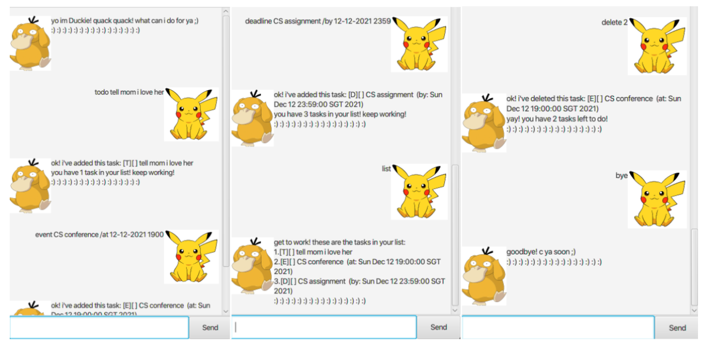

# Duke User Guide
Duke, a Personal Assistant Chatbot that helps a person to keep track of various tasks (i.e. To Do List, Deadlines and Events).
1. Ensure you have Java 11 or above installed in your Computer.
1. Download the latest Duke.jar from here.
1. Copy the file to the folder you want to use as the home folder for your Duke App.
1. Double-click the file to start the app.
   
1. Type the command in the command box and press Enter to execute it.
   Some example commands you can try:
1. Refer to the Features below for details of each command.

--------------------------------------------------------------------------------------------------------------------
## Features
Notes about the command format:
- Words in UPPER_CASE are the parameters to be supplied by the user. 
e.g. `todo DESCRIPTION` - `DESCRIPTION` is the parameter to be passed in, can be used as `todo homework`
- Items in square brackets are optional. 
e.g `deadline DESCRIPTION /by DATE [TIME]`, `TIME` is an optional parameter to be passed in, can be used as `deadline cancel spotify /by 2021-02-16 12:00`.
  
### Adding a Deadline task: `deadline`
Adds a deadline type of task to the personal task list.

Format: `deadline DESCRIPTION /by DATE [TIME]`

Examples: `deadline assignment submission /by 2021-02-16 23:30`

### Adding an Event task: `event`
Adds an event type of task to the personal task list.

Format: `event DESCRIPTION /at DATE [TIME]`

Examples: `event Sam's Birthday Party /at 2021-02-20 12:30`

### Adding a ToDo task: `todo`
Adds a todo type of task to the personal task list.

Format: `todo DESCRIPTION`

Examples: `todo borrow book`

### Listing all task(s): `task`
Shows a list of all task in the task list. Display the tasks on a desired date by entering date after the `list` command.

Format: `list [DATE]`

Examples: `list 2020-02-16`

### Search for task(s): `find`
Find tasks contain any of the given keywords.

Format: `find KEYWORD [MORE_KEYWORDS]`

Example: `find Birthday Party`

### Deleting a task: `delete`
Deletes the specified task or all the tasks from the task list.

#### Format 1: `INDEX`
Deletes the task at the specified INDEX. 
- Example: `delete 1`

#### Format 2: `all`

Deletes all the tasks from the task list. 
- Example: `delete all`

Expected outcome:

### Marking a task as done: `done`
Marks the specified task or all the tasks as done from the task list.

#### Format 1: `INDEX`

Marks the task at the specified INDEX as done.  
- Example: `done 1`

#### Format 2: `all`

Marks all the tasks from the task list as done. 
- Example: `done all`

###Saving the data
Duke data are saved in the hard disk automatically after any command that changes the data. There is no need to save manually.

--------------------------------------------------------------------------------------------------------------------

## FAQ
**Q**: How do I transfer my data to another Computer? 
**A**: Install the app in the other computer and overwrite the empty data file
it creates with the file that contains the data of your previous Snom home folder.

--------------------------------------------------------------------------------------------------------------------

## Command summary

Action | Format
--------|------------------
**todo** | `todo DESCRIPTION`
**deadline** | `deadline DESCRIPTION /by DATE[TIME]`
**event** | `event DESCRIPTION /at DATE[TIME]`
**list** | `list [DATE]`
**find** | `find KEYWORD [MORE KEYWORDS]`
**delete** | `done INDEX` or `done all`
**done** | `delete INDEX` or `delete all`
**bye** | `bye`
