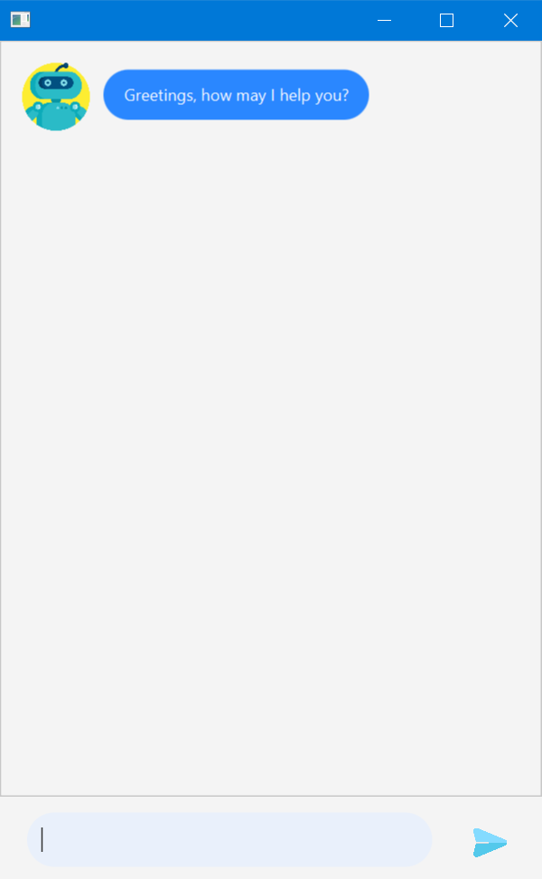

# Duke User Guide

## Introduction

Duke is a chat bot app that helps you to organise your tasks in a CLI manner with graphical feedback.

## Features
- [Adding a todo task - `todo`](#todo)
- [Adding an event task - `event`](#event)
- [Adding a deadline task - `deadline`](#deadline)
- [Listing all tasks - `list`](#list)
- [Tagging a task - `tag`](#tag)
- [Finding a task - `find`](#find)
- [Deleting a task - `delete`](#delete)
- [Marking a task as done - `done`](#done)
- [Exiting the program - `bye`](#bye) 

## Quickstart
1. Ensure you have Java 11 or above installed in your Computer.

1. Download the latest dukechatbot.jar from [here](https://github.com/markmcwong/ip/releases/tag/v0.3-Finalized).

1. Copy the file to the folder you want to use as the home folder for your Duke chatbot.

1. Double-click the file to start the app. The GUI similar to the below should appear in a few seconds.
   
1. Type the command into the textbox to interact with the chat bot

**Notes about the command format:**

Commands are presented in the format: `command ARGS`

- `command` cases do not matter (both lowercase and uppercase works fine)
- Words in `[brackets]` are optional and may not be required
- Words with a `bar|seperating` indicate one of the option should be used and only one is needed
- Words in `UPPERCASE` are arguments to be supplied by the user
- For tasks recorded with Duke:
    - *todo* is represented as `[T][ ]`
    - *deadline* is represented as `[D][ ]`
    - *event* is represented as `[E][ ]`
    - where the `[ ] ` square bracket indicates the finished status of the particular task.
    
## Usage

### <a name="todo">`todo` - Adding a todo task</a>

Adds a todo task with no due date included

Format: `todo TASK_NAME`
```
todo submit ip jar 

Got it. I've added this task:
[T][ ] submit ip jar 
Now you have 1 task in the list
```
###  <a name="deadline">`deadline` - Adding a deadline task</a>

Adds a deadline task that needs to be done before the due date.

Format: `deadline TASK_NAME /by DATE`

- `DATE` can be either in `dd MMM uuuu` format or normal string
```
deadline submit ip jar /by 19-2-2021

Got it. I've added this task:
[D][ ] submit ip jar (by: 19-2-2021)
Now you have 1 task in the list
```

###  <a name="event">`event` - Adding an event task</a>

Adds an event task that occurs at a specific time.

Format: `event TASK_NAME /at DATE`
```
event team meeting /at 2:00pm

Got it. I've added this task:
[E][ ] team meeting (at: 2:00pm)
Now you have 1 task in the list
```
### <a name="list">`list` - Listing all the tasks</a>

Shows a list of tasks recorded with Duke

- todo is represented as `[T][ ]`
- deadline is represented as `[D][ ]`
- event is represented as `[E][ ]`

where the `[ ] ` square bracket indicates the finished status of the particular task.

Format: `list`
```
list

Here are the tasks in your list:
1. [T][ ] submit ip jar
2. [D][ ] submit ip jar (by: 19-2-2021)
3. [E][ ] team meeting (at: 2:00pm)
```
### <a name="done">`done` - Marking a task as done</a>

Marks a specific task as done using the index of the task.

Format: `done INDEX`
```
done 1

Nice! I've marked this task as done: 
[T][X] submit ip jar
```
### <a name="tag">`tag` - Tagging a task</a>
Creates a tag and associate the tag with the task

Format: `tag INDEX TAG`
```
tag 1 java

Nice! I've marked task 1 with the tag: #java
```

### <a name="find">`find` - Finding a task by name or tag</a>
Finds a task which contains the given word in the name or associate with the tag

(Find by tag requires exact tag name, i.e. the item `[T][] submit ip jar #assignment` 
would require `find #assignment` but `find #assign` or `find smth #assign` won't work)

Format: `find KEYWORD|#TAG`
```
find #java

Here are the tasks in your list that fulfils your requirement:
1. [T][ ] submit ip jar
```

### <a name="delete">`delete` - Deleting a task</a>
Deletes the specific task using its index

Format: `delete INDEX`

```
delete 1

Noted. I've removed this task:
[T][ ] submit ip jar
Now you have 2 tasks in your list
```

### <a name="bye">`bye` - Exiting the program </a>

Exiting the program

Format: `bye`