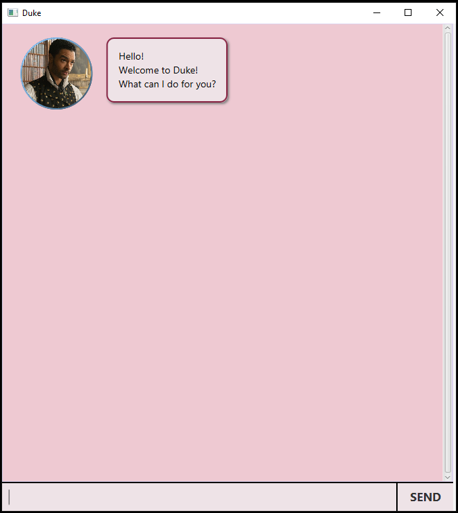

# User Guide

## Content Page
1. Introduction
2. Getting Started
3. Features
4. Additional Help
5. Acknowledgements

## Introduction 
Welcome to Duke, your one stop task manager. :smile:
With great usability and a simple design, it's never been easier to manage your tasks!

## Getting Started
1. Ensure that you have at least `Java 11` installed.
2. Download the software here
3. Once downloaded, you should see the welcome page:

   
4. Great! You're all set. Happy exploring! :grin:

### `Keyword` - Describe action

Describe action and its outcome.

Example of usage: 

`keyword (optional arguments)`

Expected outcome:

`outcome`
