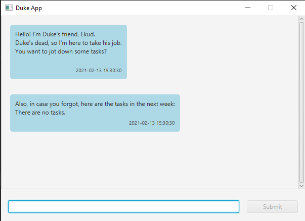
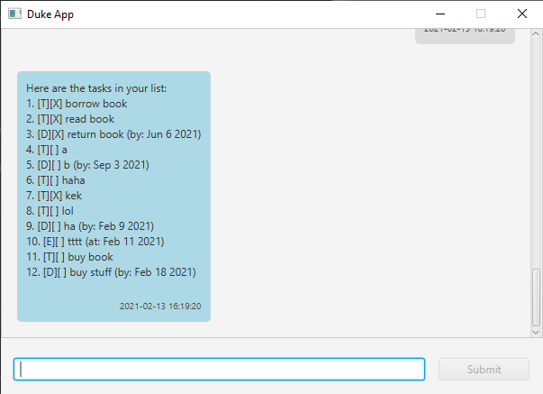
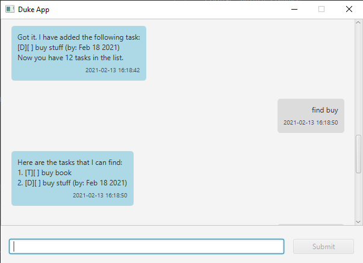
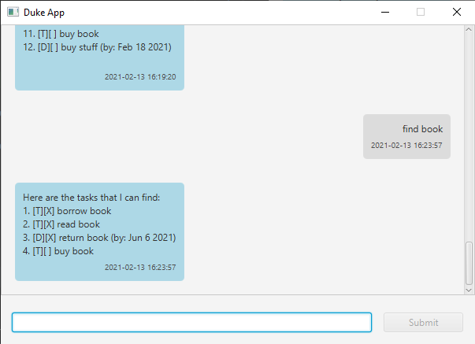
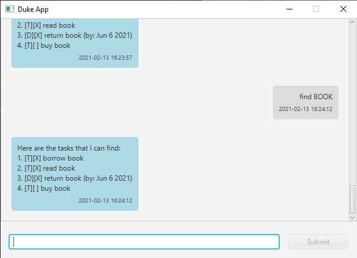

# User Guide for Duke App

**Duke App** is a chatbot for managing daily tasks. Since it is a chatbot, the main interaction will be done through a Command Line Interface (CLI), though it still furnished with a Graphical User Interface (GUI) for easy viewing.

## Contents
- [Quick Start](#quick-start)
- [Features](#features)
    - [`list`: Listing all tasks](#list-listing-all-tasks)
    - [`todo`: Adding a todo task](#todo-adding-a-todo-task)
    - [`event`: Adding an event](#event-adding-an-event)
    - [`deadline`: Adding a task with a deadline](#deadline-adding-a-task-with-a-deadline)
    - [`delete`: Deleting a task](#delete-deleting-a-task)
    - [`find`: Finding tasks](#find-finding-tasks)
    - [`remind`: Reminding upcoming tasks](#remind-reminding-upcoming-tasks)
    - [`bye`: Exiting the application](#bye-exiting-the-application)
- [Command Summary](#command-summary)

## Quick Start
1. Ensure you have Java `11` installed in your machine.

2. Download the latest release from here (link will be updated later).

3. (Optional) Copy the application to your desired folder.

4. Run the application by double clicking the application. You should see the following after a few seconds.

   
   
5. Type the command in the text field and press Enter to execute it. You may press the `Submit` button to execute it as well.
  You may wish to try the commands below.
   - `list`: List all tasks.
   - `todo Buy book`: Adds a Todo task titled `Buy book`.
   - `bye`: Exits the application.
    
6. Refer to [Features](#features) for details of the available commands.

## Features

### Notes for each command
- All commands are **not** to include commas (,) as part of the input.
- Parameters will be specified within angle brackets, e.g. `<name>`.
- If a parameter is expected only once but is specified more than once, the system will recognize it as an error.

### `list`: Listing all tasks
Showing the list of the available tasks saved in the system.  
Format: `list`

### `todo`: Adding a todo task
Adds a task to be done some (unspecified) time in the future.  
Format: `todo <taskName>` 
Example: `todo Visit Ekud`

### `event`: Adding an event
Adds an event scheduled on a specified date.  
Format: `event <taskName> /at <date>`

 - The `<date>` must be in the format **yyyy-mm-dd**. To insert 2nd March 2021 as the date, one must input 2021-03-02.

Example: `event Duke's funeral /at 2021-02-19`

### `deadline`: Adding a task with a deadline
Adds a task to be done by a specified date.  
Format: `deadline <taskName> /by <date>`

- The `<date>` must be in the format **yyyy-mm-dd**. To insert 2nd March 2021 as the date, one must input 2021-03-02.

Example: `deadline Buy flowers for Duke /by 2021-02-17`

### `delete`: Deleting a task
Deletes a task at a specified index.  
Format: `delete <index>`

- The `<index>` refers to the index of the tasks saved in the system.
- The `<index>` must be a **positve integer**, e.g. 1, 2, 3,....

Example: `delete 2` will delete the second task saved in the system.

### `find`: Finding tasks
Finds the tasks matching the keyword.  
Format: `find <keyword>`

To demonstrate, we will be working with the following list of tasks.

- The system will find tasks containing the inputted `keyword`. If, for instance, the user inputs `find buy`, the system will return list of tasks containing the word `buy`.
  
  
- This feature is case-insensitive. The result will be the same if the user inputs `find BOOK` instead of `find book`.

    `find book` | `find BOOK`
    :-------------------:|:-------------------:
     | 

### `remind`: Reminding upcoming tasks
Reminds user about the upcoming tasks within the next few days.  
Format: `remind` or `remind <days>`

- The parameter `<days>` is optional. If provided, it must be a **positive integer**, e.g. 1,2,3,.... If not provided, it will default to finding the tasks within the next week.

Example: `remind 4` will return tasks scheduled within the next 4 days.

### `bye`: Exiting the application
Exits the application.  
Format: `bye`

## Command Summary

Action | Format, Examples
------- | ----------------
List | `list`
Add a todo task | `todo <taskName>`   e.g. `todo Buy flowers`
Add an event | `event <taskName> /at <date>`   e.g. `event Duke's funeral /at 2020-02-19`
Add a task with deadline | `deadline <taskName> /by <date>`   e.g. `deadline Buy flowes for Duke /by 2021-02-17`
Delete | `delete <index>`   e.g. `delete 2`
Find | `find <keyword>`   e.g. `find buy`
Remind | `remind` or `remind <days>`   e.g. `remind 4`
Exit | `bye`

