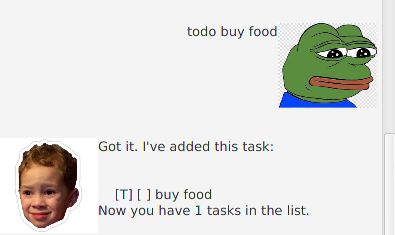
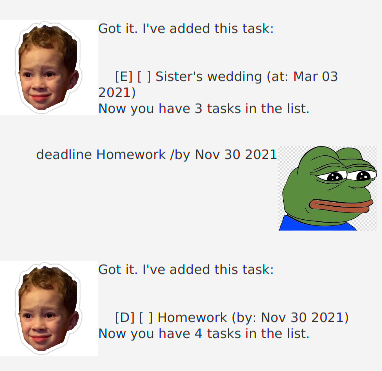
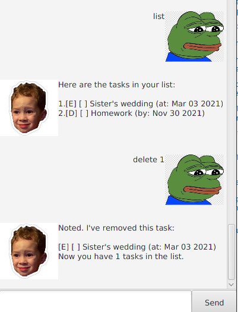

# User Guide

## Features 

### Add a to do task. 
The basic task to add to Duke is a to do task which you can 
mark as done when it is complete.



### Add a dated task.
You may also add dated tasks for Duke to remember. 
You can either add a deadline or an event.



### View and delete tasks
Once you have added some of the tasks described above, 
you may view or delete them using Duke.



## Usage

### 1. `todo` - Add to do task

Adds a new to do task to the list of tasks.

**Example of usage**: 

`todo (task description)`

**Expected outcome**:

Duke responses to confirm that the to do task has
been added successfully.

```
Got it: I've added this task:

   [T][ ] (task description)
Now you have (number of tasks) in the list.
```

### 2. `deadline` - Add new deadline

Adds a new deadline to the list of tasks.

**Example of usage**:

`deadline (deadline description) /by (date)`

**Expected outcome**:

Duke responses to confirm that the deadline has
been added successfully.

```
Got it: I've added this task:

   [D][ ] (deadline description) (by:(date))
Now you have (number of tasks) in the list.
```
### 3. `event` - Add new event

Adds a new event to the list of tasks.

**Example of usage**:

`event (event description) /at (date)`

**Expected outcome**:

Duke responses to confirm that the event has
been added successfully.

```
Got it: I've added this task:

   [E][ ] (event description) (at:(date))
Now you have (number of tasks) in the list.
```

### 4. `list` - List tasks

Lists all tasks that you have asked Duke to remember.

**Example of usage**:

`list`

`list (date)`

**Expected outcome**:

Duke lists all the tasks if no date is provided or lists all tasks that happen on the given date.

```
Here are the tasks in your list:

1. (Task)
2. (Task)
```
```
Found the following tasks on 2021-11-30:
1. (Task)
```

### 5. `done` - Mark task as done

Marks the task with the given task number as done.

**Example of usage**:

`done (task number)`

**Expected outcome**:

Duke responses to confirm that the task has been marked
as done successfully. The box beside the type of task will 
also be checked.

```
Nice! I've marked this task as done:
(Task)
```

### 6. `delete` - Delete a task

Deletes the task with the given task number from
Duke.

**Example of usage**:

`delete (task number)`

**Expected outcome**:

Duke responses to confirm that the task has been deleted successfully. 

```
Noted. I've removed this task:
(Task)
Now you have (number of tasks) in the list.
```

### 7. `find` - Find a task

Filters through all tasks in Duke to find tasks which contain
the keywords that you provide.

**Example of usage**:

`find (keywords)`

**Expected outcome**:

Duke lists out all tasks that contain your keywords.

```
Found (number of matches) matching tasks(s):
(Task)
```

### 8. `sort` - Find a task

Sorts the list of tasks remembered by Duke based on your input.

**Example of usage**:

You may specify the sort direction using `asc` or `desc`.

To sort the list by date:
`sort date (sort direction)` 

To sort the list by the task description: `sort task (sort direction)`


**Expected outcome**:

Duke lists out all tasks after they have been sorted.

```
The list has been sorted by (date/description) in
(ascending/descending) order.
Here are the tasks in your list:

1. (Task)
...
```
