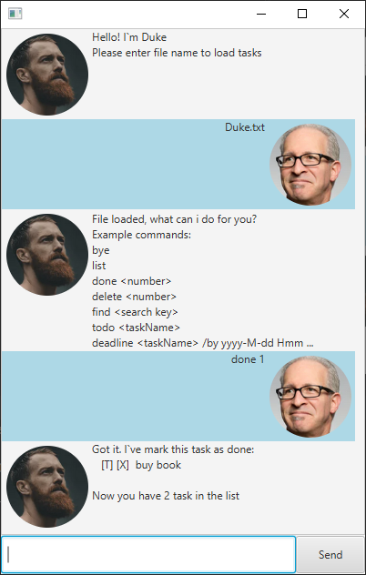
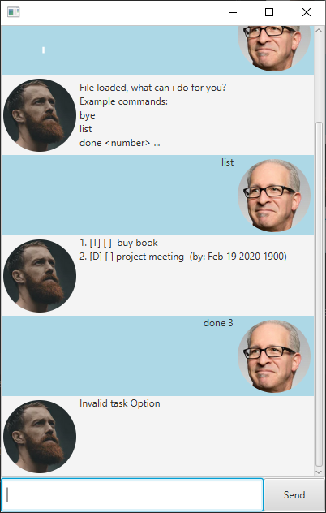
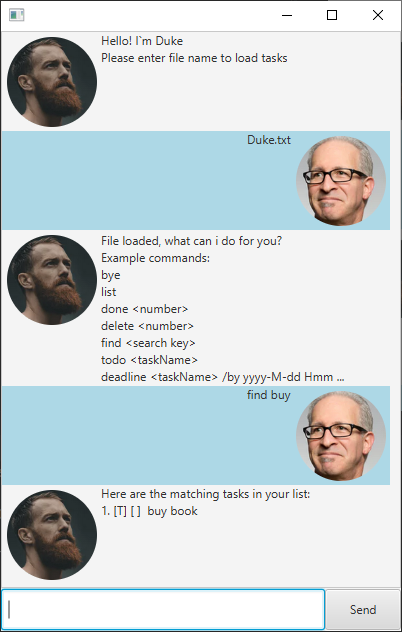

# User Guide

## Features 

### Viewing tasks: `list`
### Complete a task: `done`
### Delete a task: `delete`
### find tasks: `find`
### Add a todo task : `todo`
### Add a deadline task : `deadline`
### Add a Event task: `event`
### Exit the program : `bye`

## Usage

### `list` - list all the task
Shows all tasks that are currently in Duke

Format: `list`

Example of usage: `list`

Expected outcome:

Or

### `done` - Completes a task 
Marks a given task number as done
Format: `done INDEX`
- INDEX is a non negative number
- INDEX starts from 1 - number of task in Duke 

Example of usage: `done 1`

Expected outcome: 

Or

### `delete` - Deletes a task 
Deletes a given task number in Duke

Format: `delete INDEX`
- INDEX is a non negative number
- INDEX starts from 1 - number of task in Duke 
  
Example of usage: `delete 1`

Expected outcome:

Or

### `find` - Finding of tasks 
finds tasks that contains a certain keyword

Format: `find SeachKey`
- The search is case-insensitive. e.g buy will match Buy
- Only task description will be searched

Example of usage: `find buy`

Expected outcome:

Or

### `todo <taskName>` - Adds a todo task 
Adds a todo task into Duke

Format : `todo taskName`

Example of usage: `todo buy book`

Expected outcome:

### `deadline <taskName> /by <deadline>` - Adds a deadline task 
Adds a deadline task into Duke 

Format: `deadline taskName /by yyyy-M-dd hhmm`
- deadline has to be in the form of yyyy-M-dd hmm or yyyy-mm-dd hhmm (e.g 2021-5-03 630 or 2021-05-03 0630)

Example of usage: `deadline project meeting \by 2020-2-15 1600`

Expected outcome:

### `event <taskName> /by <deadline>` -  Adds a event task 
Adds a event task into Duke 

Format: `event taskName /by yyyy-M-dd hhmm - hhmm`
- deadline has to be in the form of yyyy-M-dd hmm - hmm or yyyy-mm-dd hhmm - hhmm 
  (e.g 2021-5-03 630 - 830 or 2021-05-03 0630 - 0830)

Example of usage: `event mid terms \by 2020-03-07 830 - 1000`

Expected outcome:

### `bye` - exits the application
Saves the current tasks into file specificed at the start 

Example of usage: `bye`