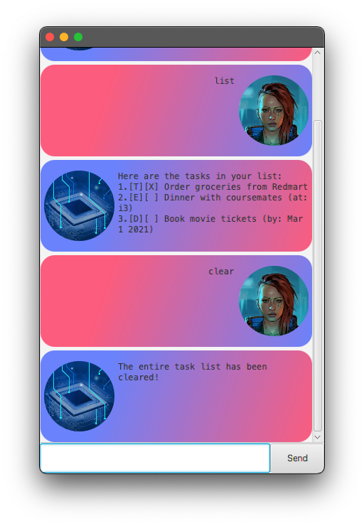

# User Guide

## Features 

### Adding a `todo`
Adds a todo task to Duke.

Format: `todo DESCRIPTION`

Example: `todo Order groceries from Redmart`

### Adding an `event`
Adds a event task to Duke.

Format: `event DESCRIPTION /at LOCATION`

Example: `event Dinner with coursemates /at i3`

### Adding a `deadline`
Adds a deadline task to Duke.

Format: `deadline DESCRIPTION /by YYYY-MM-DD [hh:mm]`

- It is optional to include a time

Examples: 
- `deadline Book movie tickets /by 2021-03-01`
- `deadline Preorder sneakers /by 2021-04-15 21:00`

### `clear` the task list
Clear all tasks within Duke

Format: `clear`

### `delete` a task
Delete a given tasks within Duke

Format: `delete N`

Example: `delete 1`

### Mark a task as `done`
Clear all tasks within Duke

Format: `done N`

Example: `done 1`

### `find` a task
Search for a task within Duke

Format: `find DESCRIPTION`

Example: `find movie`

### `list` the task list
List all tasks within Duke

Format: `list`

### Good`bye`
Exit Duke

Format: `bye`

