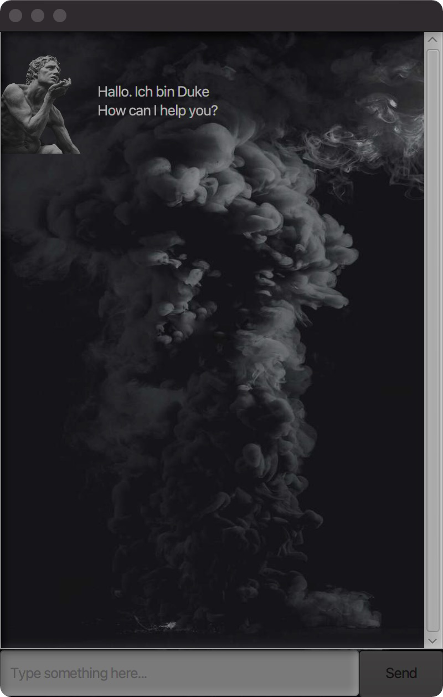
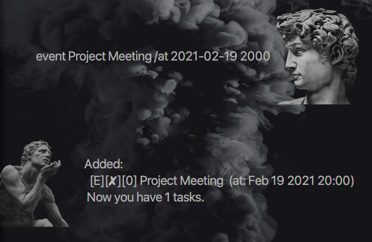
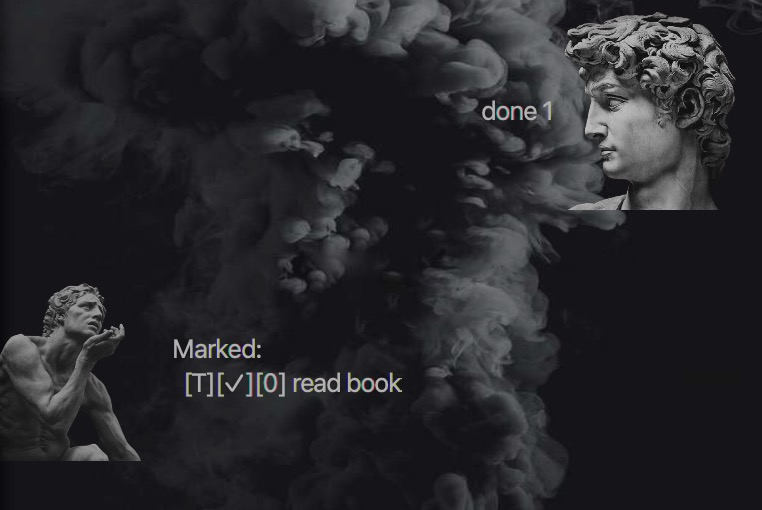
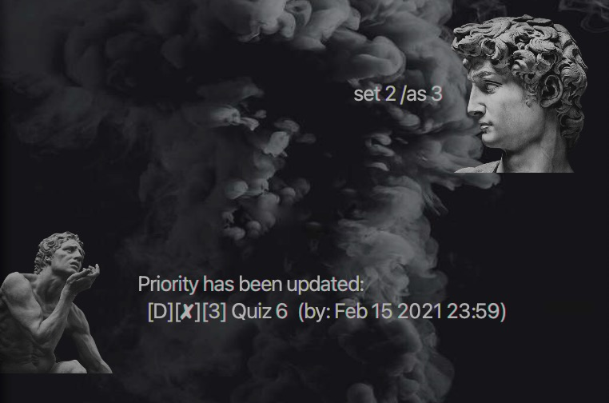

# User Guide

* [Introduction](#introduction)
* [Quick Start](#quick-start)
* [Features](#features)

## Introduction
Duke is a personal task managing application which is based on Command Line Tool. 
It aims to help individuals keep track of various tasks.

## Quick Start
1. Ensure you have Java 11 or above installed in your Computer. 

2. Download the latest `Duke.jar` from [here](https://github.com/ljhgab/ip/releases).

3. Copy the file to the folder you want to use as the home folder for your Duke.

4. Double-click the file to start the app. The GUI similar to the below should appear in a few seconds.

5. Type the command in the command box and press Enter to execute it.
   Some example commands you can try:
   * `list` : Lists all tasks.
    * `todo read book` : Adds a Todo type task named "read book" to the Task List.
    * `done 1` : Marks the first task in the list as completed.
    * `delete 1` : Removes the first task in the list.
    * `bye` : Exit the app.
    
6. Refer to the [Features](#Features) below for more commands and their details. 

## Features 

#### ℹ️ Notes about the command format
* Words in `UPPER_CASE` are the parameters to be specified by the user.
e.g.in todo `TASK_NAME`, `TASK_NAME` is a parameter which can be used as `todo read book`.
* The format of `TIME` is `yyyy-MM-dd HHmm` 

---
### `todo` - Adding a Todo task
Adds a Todo type task into the Task List.

Format: `todo TASK_NAME`

Example of usage:

`todo read book`

Expected outcome:

### `deadline` - Adding a Deadline task

Adds a Deadline task into the Task List.

Format: deadline `TASK_NAME` /by `TIME`

Example of usage: 

`deadline Quiz 6 /by 2021-02-15 2359`

Expected outcome:

### `event` - Adding an Event task

Adds an Event task into the Task List.

Format: event `TASK_NAME` /at `TIME`

Example of usage:

`event Project Meeting /at 2021-02-19 2000`

Expected outcome:

### `list` - Listing all tasks

Shows all the existing tasks in the Task List.

Format: `list`

Example of usage:

`list`

Expected outcome:

### `done` - Marking task as completed

Marks the specified task as completed.

Format: `done INDEX`

Example of usage:

`done 1`

Expected outcome:

### `delete` - Deleting a task

Removes the specified task from the Task List.

Format: `delete INDEX`

Example of usage:

`delete 2`

Expected outcome:

### `find` - Finding tasks

Searches tasks that contain the keyword from the Task List.

Format: `find KEYWORD`

Example of usage:

`find Meeting`

Expected outcome:

### `set` - Setting priority

Gives a specified task an integer between 1-3 which denotes priority.

Format: `set INDEX /as PRIORITY_NUMBER`

Example of usage:

`set 2 /as 3`

Expected outcome:

### `bye` - Ending a conversation

Says goodbye and terminates the program in 3 seconds.

Format: `bye`

Example of usage:

`bye`

Expected outcome:

