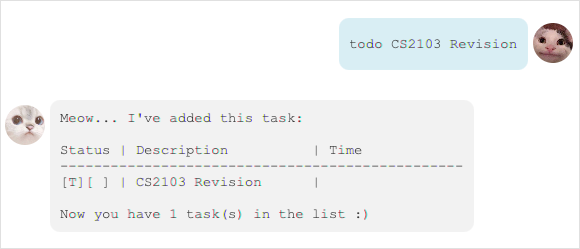
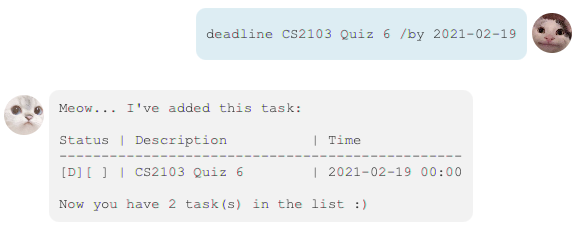
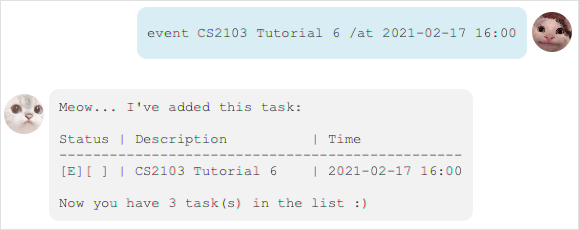
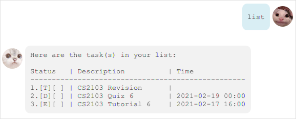
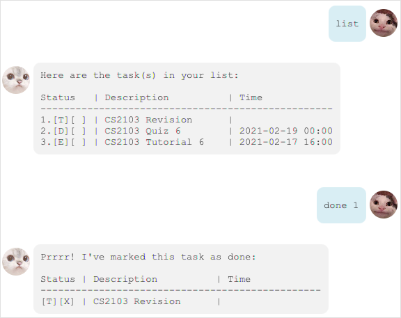
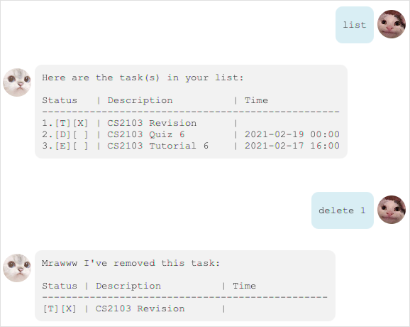
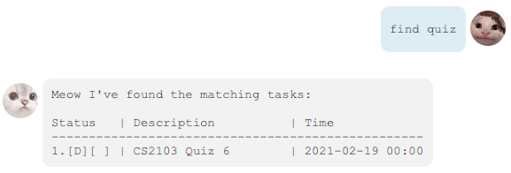
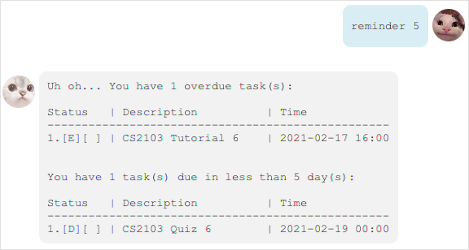

# User Guide

In short, **Nana the Cat Manager** is a **to-do list** desktop application with the GUI of a messaging app.

The app manages a list of tasks, recording and tracking the following information for each:

1. The task's status, i.e. whether it is done.
2. The task's description.
3. The task's deadline or time.

 

## Features

### Add To-do Task

Adds a task of to-do type to the lists of tasks.

### Add Deadline Task

Adds a task of deadline type to the lists of tasks.

### Add Event Task

Adds a task of event type to the lists of tasks.

### List Tasks

Displays the list of tasks with index numbers, statuses, descriptions, and time.

### Mark as Done

Marks a task in the list of tasks as done.

### Delete Task

Deletes a task from the list of tasks.

### Find Task

Lists the tasks with descriptions matching some specified keyword(s).

### Get Reminder

Lists the tasks which are overdue or urgent.

### Save Data & Terminate Application

Saves the lists of tasks into the hard drive before terminating the application.

### Load Save Data

Loads the lists of tasks saved from the previous session.

 

## Usage

This section specifies the respective commands to execute each feature.

#### Notes about the command format:

* Words in `UPPER_CASE` are the parameters to be supplied by the user. 
  e.g. in `todo DESCRIPTION`, `DESCRIPTION` is a parameter specifying the to-do's description, as
  in `todo CS2103 Revision`.

* Items in square brackets are optional. 
  e.g. Both `deadline CS2103 Quiz 6 2021-02-19`and `deadline CS2103 Quiz 6 2021-02-19 14:00`
  works, w.r.t the command `deadline DESCRIPTION /by DATE [TIME]`.

* Commands must follow the exact order as specified below. 

* Extraneous parameters for commands that do not take in parameters will be ignored. 
  e.g. if the command specifies `list 123`, it will be interpreted as `list`.

 

### `todo`: Add To-do Task

Adds a new task of to-do type to the list of tasks.

Command format: `todo DESCRIPTION`

Example of usage:

 

### `deadline`: Add Deadline Task

Adds a new task of deadline type to the list of tasks.

Command format: `deadline DESCRIPTION /by DATE [TIME]`

- `DATE` must follow the `YYYY-MM-DD` format.
- `TIME` must follow the `HH:mm` format.

Example of usage:

 

### `event`: Add Event Task

Adds a new task of event type to the list of tasks.

Command format: `event DESCRIPTION /at DATE [TIME]`

- `DATE` must follow the `YYYY-MM-DD` format.
- `TIME` must follow the `HH:mm` format.

Example of usage:

 

### `list`: List Tasks

Displays the list of tasks with index numbers, statuses, descriptions, and timings.

Command format: `list`

Example of usage:

 

### `done`: Mark as Done

Marks a task, at a specified index in the list of tasks, as done.

Command format: `done INDEX`

- Marks the task at the specified `INDEX` as done.
- `INDEX` must be a positive integer
- To find out the index of a particular task, use the `list` command.

Example of usage:

 

### `delete`: Delete Task

Deletes a task from the list of tasks.

Command format: `delete INDEX`

- Deletes the task at the specified `INDEX`.
- `INDEX` index must be a positive integer.
- To find out the index of a particular task, use the `list` command.

Example of usage:

 

### `find`: Find Task

Lists the tasks with descriptions matching some specified keyword(s), if any.

Command format: `find KEYWORDS`

Example of usage:

 

### `reminder`: Get Reminder

Lists the tasks which are overdue or urgent, if any.

Command format: `reminder URGENCY`

- `URGENCY` refers to the number of days used when determining whether a task is urgent.
- Suppose a task's deadline is in 2 days.
    - If `URGENCY` is 1, then the task is considered urgent.
    - If `URGENCY` is 3, then the task is considered not urgent.

Example of usage:

 

### `bye`: Save Data & Terminate Application

Terminates the application, but only after saving the task list into the hard drive.

Command format: `bye`

 

### Load Save Data

This is done automatically upon launching the application.

 
