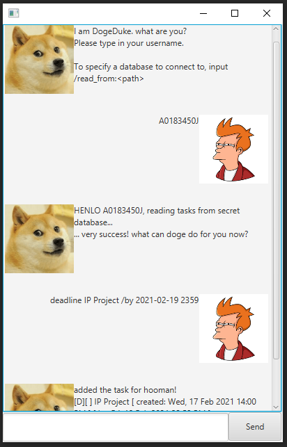

# User Guide

YingJen is a chatbot-style personal task manager. He can help track your to-dos, events and deadline. He has a 
Graphical User Interface (v0.2 onwards), and short aliases for commands.

## Quick Start
1. Ensure you have Java 11 or later installed.
1. Download the latest `YingJen.jar` from [here](https://github.com/benedictkhoomw/ip/releases).
1. Double-click the application to launch it. If you encounter an error, try opening a terminal
and typing `java -jar YingJen.jar` then press `Enter`.
1. Once launched, type a command (listed below) into the command box and press `Enter` to execute it.

## Format of Usage section
* Command keywords are listed as `command`/`alias` where `alias` is a shorter form of the keyword that
  can be typed instead of the full keyword.
* Command arguments are denoted with angled brackets `<>`. These should be replaced with appropriate
  arguments for the command.
* Command examples are listed for complex commands.

## Usage

### `todo`/`t` - Adds a todo task

Adds a task you need to do.

#### Syntax: 

`todo <task description>`  
`t <task description>`

#### Examples:

`todo math homework`  
`t science homework`

---

### `deadline`/`de` - Adds a deadline

Adds a task with a deadline. The deadline should be of the format `yyyy-mm-dd`. E.g. `2021-05-10`.

#### Syntax:

`deadline <task description> /by <yyyy-mm-dd>`  
`de <task description> /by <yyyy-mm-dd>`

#### Examples:

`deadline math homework /by 2021-05-10`  
`de science homework /by 2021-05-09`

---

### `event`/`e` - Adds an event

Adds a task that occurs within a period. The period format is freeform but compulsory.

#### Syntax:

`event <task description> /at <period>`  
`e <task description> /at <period>`

#### Examples:

`event math class /at Monday 5pm - 7pm`  
`e science class /at never`

---

### `done`/`d` - Marks a task as done

Marks a task as done by index. The task index is its position shown in `list`.

#### Syntax:

`done <task index>`  
`d <task index>`

#### Examples:

`done 1`  
`d 20`

---

### `delete`/`del`/`rm` - Removes a task

Removes a task from the list by index. YingJen will stop tracking the task for you. 
The task index is its position shown in `list`.

#### Syntax:

`delete <task index>`  
`del <task index>`  
`rm <task index>`

#### Examples:

`delete 1`  
`del 20`  
`rm 2`

---

### `list`/`l` - Lists all tasks

Lists all tracked tasks and their statuses.

#### Syntax:

`list`  
`l`

---

### `find`/`f` - Find tasks

Searches for then lists tasks containing a given search term. 
The search term can have spaces.

#### Syntax:

`find <search term>`  
`f <search term>`

#### Examples:

`find happiness and love`  
`f math`

---

### `bye`/`b` - Exits app

Exits the application. YingJen will remember the tasks you told him to track when the
app is re-launched.

#### Syntax:

`bye`  
`b`