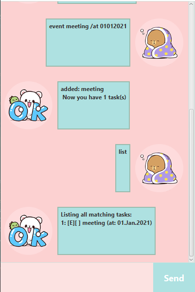

# User Guide

## Features 

* Listing all tasks: `list`
* Adding a To Do Task: `todo`
* Adding a Deadline Task: `deadline`
* Adding an Event Task: `event`
* Marking a Task as done: `done`
* Deleting a Task: `delete`
* Finding a Task using keywords: `find`
* Exiting Duke: `bye`

## Usage

### Listing all tasks: `list`

Lists all tasks stored inside of Duke.

Format: `list`

Expected outcome:

### Adding a To Do Task: `todo`

Adds a To Do Task to Duke. Task has default state of being incomplete

Format: `todo NAME`

Example of usage:

`todo this`

Expected outcome:

### Adding a Deadline Task: `deadline`

Adds a Deadline Task to Duke. Task has default state of being incomplete

Format: `deadline NAME /by DATE`
* `DATE` refers to date at which task must be completed by. Takes format of `DDMMYYYY`.

Example of usage:

`deadline that /by 25121999`

Expected outcome:

### Adding an Event Task: `event`

Adds an Event Task to Duke. Task has default state of being incomplete

Format: `event NAME /at DATE [/year OCCURRENCES YEAR] [/month OCCURRENCES MONTH] [/day OCCURRENCES DAY]`
* `DATE` refers to date that event occurs. Also used as base date for future occurrences. Takes format of `DDMMYYYY`.
* `/year`, `/month`, `/day` sets the denominator of recurrence. 
  * `OCCURRENCES` state how many times the event occurs.
  * `YEAR`, `MONTH`, `DAY` states how much of each denomination between each occurrence.
  * Optional flags are mutually exclusive. If more than one is provided, the first appearance of the flag will be taken. 

Example of usage:

1. `event meeting /at 01012021`
1. `event lecture /at 01012021 /day 13 7`

Expected outcome:

Image of Event Task Feature without optional tags

Image of Event Task Feature with optional tags

### Marking a Task as done: `done`

Marks task at specified index as done.

Format: `done INDEX`
* Marks the task at specified `INDEX` done. Index refers to index number shown in the displayed tasks list. Index <b> must be a positive integer </b> and <b> refers to an incomplete task</b>.

Example of usage:

`done 1`

Expected outcome:

### Deleting a Task: `delete`

Deletes task at specified index.

Format: `delete INDEX`
* Deletes the task at specified `INDEX` done. Index refers to index number shown in the displayed tasks list. Index <b> must be a positive integer</b>.

Example of usage:

`delete 1`

Expected outcome:

### Finding a Task using keywords: `find`

Find tasks that contain the given keyword in its name.

Format: `find KEYWORD`

Example of usage:

`find that`

Expected outcome:

### Exiting Duke: `bye`

Exits Duke.

Format: `bye`

Expected outcome:
* Program Exits
