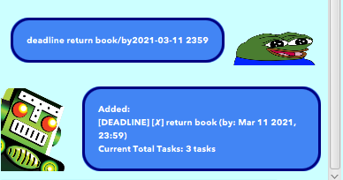

<h1>
    
      B.O.B Task Manager User Guide
   
</h1>
A todo task manager bot to record and store list of tasks.

Image Source: MrDestructoid (Twitch Emote) 

# Features
Below are the features currently implemented:

1. [**`Add`**](#add) Adding tasks to the bot.
   - 1.1. [**`Todo`**](#todo)
   - 1.2. [**`Event`**](#event)
   - 1.3. [**`Deadline`**](#deadline)
2. [**`List`**](#list) Listing all existing tasks.
3. [**`Marking Done`**](#done) Mark completed tasks as done.
4. [**`Delete`**](#delete) Deleting tasks using index.
5. [**`Find`**](#find) Finding tasks based on keywords.
6. [**`Remind`**](#remind) Remind Users about upcoming tasks.
7. [**`Storage & Retrieval`**](#storage) Storing of tasks in local drive.

## Feature Details

<h3>
    
      Feature 1 - Adding tasks
   
</h3>

The user will be able to add new tasks into B.O.B Task Manager. 

There are 3 types of tasking of which the user can
segment his tasks into.
- Todo
- Event
- Deadline

### Todo
Adds a todo task with **task description** into B.O.B Task Manager.

**Command Syntax**
    
    todo <task description> 

**Example of usage:**

    todo read book

**Expected outcome:**

CLI:

    ADDED: [TODO][X] read book
    Current Total Tasks: 1 task

GUI

### Event
Adds an event task with the **task description** and 
**Date and Time** into B.O.B Task Manager.

**Command Syntax**
    
    event <task description>/at<Date & Time>

**Date & Time format:** `yyyy-MM-dd HHmm`

**Example of usage:**

    event watch movie/at2021-02-14 1700

**Expected outcome:**

CLI:

    ADDED: [EVENT][X] watch movie (at: Feb 14 2021, 17:00)
    Current Total Tasks: 2 tasks

GUI:

### Deadline
Adds a deadline task with the **task description** and
**Date and Time** into B.O.B Task Manager.
      
**Command Syntax**
    
    deadline <task description>/by<Date & Time>

**Date & Time format:** `yyyy-MM-dd HHmm`

**Example of usage:**
 
    deadline return book/by2021-03-11 2359

**Expected outcome:**

CLI:

    ADDED: [DEADLINE][X] return book (by: Mar 11 2021, 23:59)
    Current Total Tasks: 3 tasks

GUI:

---

<h3>
    
      Feature 2 - Listing tasks
   
</h3>
The user will be able to list all existing tasks in B.O.B Task Manager.

**Command Syntax** 
  
    list

**Example of usage:**

    list

**Expected outcome:**

CLI:

    Ok Human. Here are your tasks:
        1. [TODO][X] read book
        2. [EVENT][X] watch movie (at: Feb 14 2021, 17:00)
        3. [DEADLINE][X] return book (by: Mar 11 2021, 23:59)

GUI:

      

---

<h3>
    
      Feature 3 - Marking Done  
   
</h3>

Marks the completion of a task using the index of the task. 

Completion status is indicated by a `X` or `✓`.

**Command Syntax**

      done <index of task>

Note: The index of the task corresponds to the number beside it when listed, you can simply use `list`
to get the index of the task.

**Example of usage:**

    done 1

**Expected outcome:**

CLI:

    Noted Human. I've marked this task as done:
    [TODO][✓] read book

GUI:

---

<h3>
    
      Feature 4 - Delete  
   
</h3>

Deletes a task from the list using the index of the task.

**Command Syntax**

      delete <index of task>

Note: The index of the task corresponds to the number beside it when listed, you can simply use `list`
to get the index of the task.

**Example of usage:**

    delete 1

**Expected outcome:**

CLI:

    Task deleted successfully:
    [TODO][✓] read book
    Current Total Tasks: 2 tasks
    

GUI:

----

<h3>
    
      Feature 5 - Find  
   
</h3>

Find task(s) from the list using a given keyword and lists only the relevant task(s).

**Command Syntax**

      find <key word(s)>

**Example of usage:**

    find book

**Expected outcome:**

CLI:

    Ok Human. Here are the tasks I found:
    1: [DEADLINE][X] return book (by: Mar 11 2021, 23:59)

GUI:

---

<h3>
    
      Feature 6 - Remind  
   
</h3>

Show upcoming task(s), and optional **number of days** argument can be given to 
specify the maximum time span (in days) for the task to be considered 'upcoming'.

**Command Syntax**

       remind
or

       remind <number of days>

Note: If **number of days** not specified, the default time span is 3 days. 
This can be configured in the line below in RemindCommand.java

      private static final int DEFAULT_NUM_DAYS = 3;

Full file path relative to root of project folder: `/src/main/java/duke/command/RemindCommand.java`

**Example of usage:**

    remind 30

**Expected outcome:**

CLI:

    Ok Human. Here are the tasks I found:
    1: [DEADLINE][X] return book (by: Mar 11 2021, 23:59)

GUI:

---

<h3>
    
      Feature 7 - Storage and Retrieval of Tasks  
   
</h3>

B.O.B Task Manager will attempt to retrieve stored tasks from a storage file 
in your local computer. Upon launching, it will parse through the
text file and populate the application with the stored data.

If there are no storage files are found, a text file named `tasks.txt` will be  
in created in the root directory of the project. All subsequent information will
be stored in this file.

The default file path is set as shown below:

    private final String defaultPath = "./tasks.txt";

If you would like to change the default directory or change the filename, 
you can edit the above code in `Storage.java`. 

Full file path relative to root of project folder: `/src/main/java/duke/Storage.java`

---

# THE END
