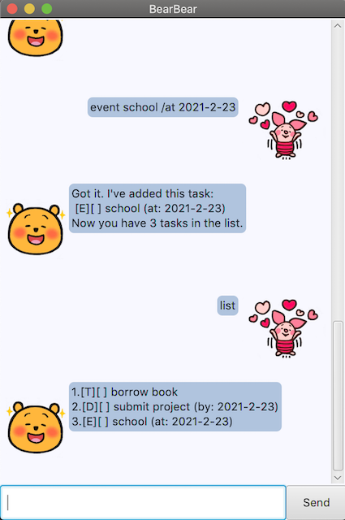
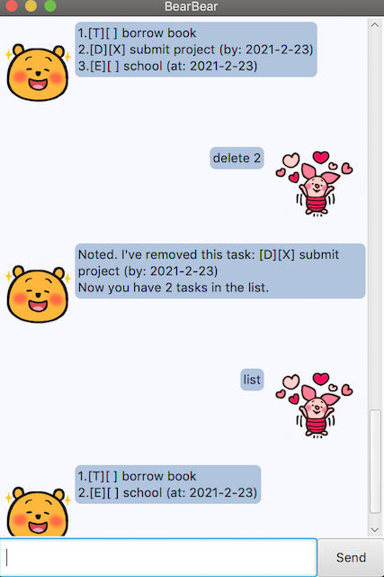
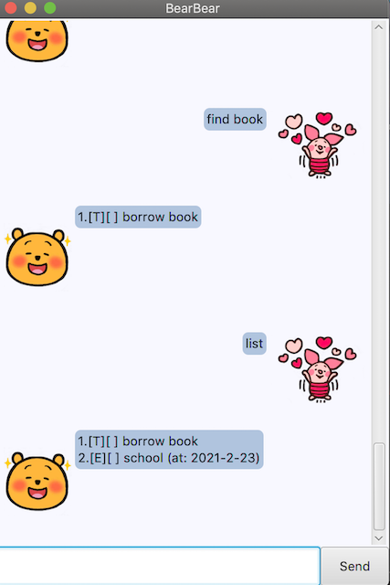

# User Guide
BearBear is a desktop task manager application done as part of the CS2103T module in NUS.

## Content Page 
* [Add Todo Task](#todo-task)
* [Add Deadline Task](#deadline-task)
* [Add Event Task](#event-task)
* [Mark Task as Complete](#mark-task-as-complete)
* [Delete Task](#delete-task)
* [Find Task](#find-task)
* [List Tasks](#list-tasks)
* [View Help guide](#view-help-guide)
* [Exit Application](#exit-application)

## Features
### Add Todo Task
* Description: Creates and adds a Todo task to the task list.
* Format: `todo <task_description>`
* Example: `todo borrow book`

### Add Deadline Task
* Description: Creates and adds a Deadline task to the task list.
* Format: `deadline <task_description> <deadline>`
* Examples:
    1. `deadline submit project /by Sunday 2359`
    2. `deadline submit project /by 2021-2-23`
  

    
### Add Event Task
* Description: Creates and adds an Event task to the task list.
* Format: `event <task_description> <event_time>`
* Examples:
    1. `event school /at Monday 1400`
    2. `event school /at 2021-2-23`
  

### Mark Task as Complete
* Description: Marks a task corresponding to a task index in task list as complete.
* Format: done <task_index>
* Example: `done 2`

### Delete Task
* Description: Deletes a task corresponding to a task index in task list.
* Format: delete <task_index>
* Example: `delete 2`

### Find Task
* Description: Finds a task with task description that matches a keyword.
* Format: `find <keyword>`
* Example: `find book`

### List Tasks
* Description: Shows a list of all tasks.
* Format: `list`
* Example: `list`

### View Help guide
* Description: Shows a list of supported commands and their descriptions.
* Format: `help`
* Example: `help`

### Exit Application
* Description: Terminates the application.
* Format: `bye`
* Example: `bye`

