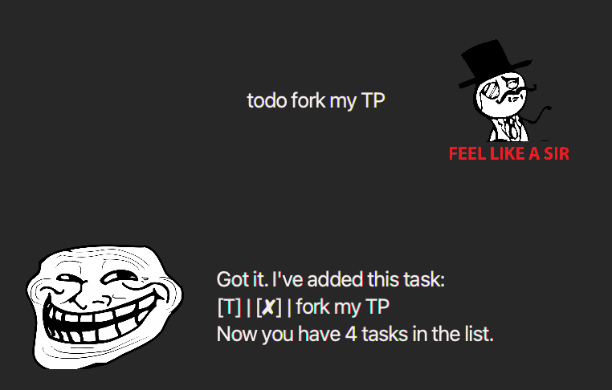
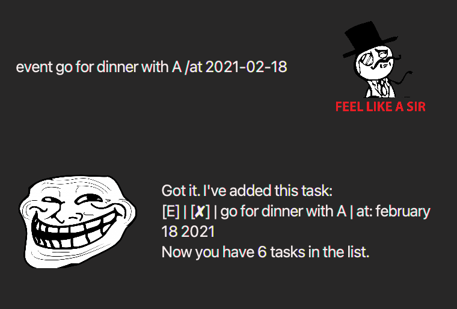
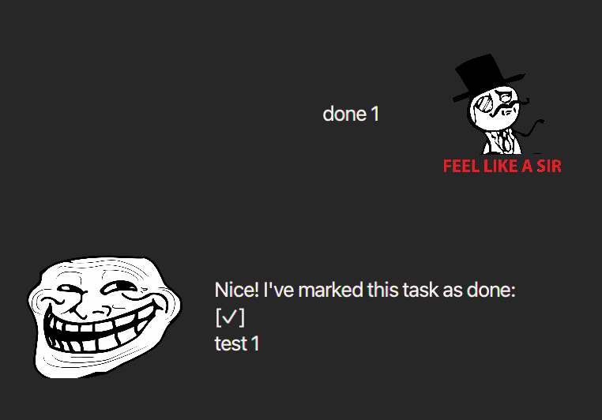
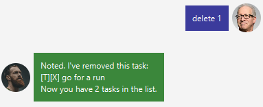

# User Guide
Meme Bot is a chatbot-style todo list application that can manage your 
tasks. It can mainly handle todo, deadline and events tasks.
## Features 

### Feature 1: `todo`

## Usage

### `todo <task name>` - Adds a todo task

Adds a task of todo type into your task list.

Example of usage: 

### Feature 2: `event`

## Usage

### `event <task name> /at <event date>` - Adds an event task

Adds a task of event type into your task list.

Example of usage: 

### Feature 3: `deadline`

## Usage

### `deadline <task name> /by <deadline date>` - Adds a deadline task

Adds a task of deadline type into your task list.

Example of usage: 

### Feature 4: `list`

## Usage

### `list` - Displays your task list.

Displays all the tasks and their respective status' present in your task list.

Example of usage: 

### Feature 5: `done`

## Usage

### `done` - Marks a task as done

Changes the status of a task in your list to "done".

Example of usage: 

### Feature 6: `delete`

## Usage

### `delete <task number>` - deletes a task

Deletes the task from your list with the given task number.

Example of usage: 

### Feature 7: `undo`

## Usage

### `undo` - undo previous command

Undoes your previous command if the command can be undone. 
List of valid commands that can be undone:
* todo 
* event
* deadline 
* done
* delete

Example of usage: 

### Feature 8: `bye`

## Usage

### `bye` - Exits Meme Bot.

Quits the application and saves all your tasks locally.

Example of usage: 

