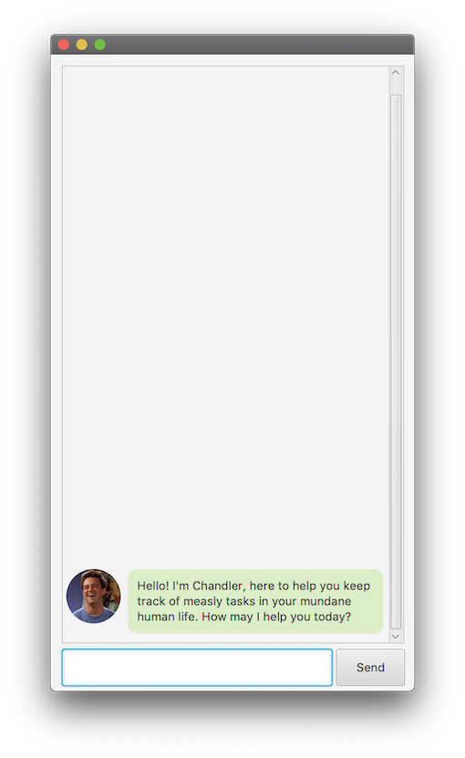
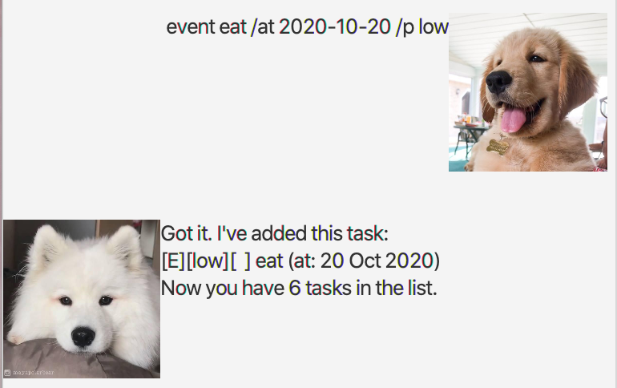

# User Guide

Hello Human! Welcome to Chandler's User Guide. Chandler is a friendly chatbot, here to help you manage your tasks in your daily life. He can help keep track of your todos, deadlines and events. Let's get started!

1. [Quick Start](#quick-start)
2. [Features](#features)
   * [Adding a todo task](#adding-a-todo-task-todo)
   * [Adding a deadline task](#adding-a-deadline-task-deadline)
   * [Adding an event task](#adding-an-event-task-event)
   * [Listing all tasks](#listing-all-tasks-list)
   * [Marking a task as done](#marking-a-task-as-done-done)
   * [Deleting a task](#deleting-a-task-delete)
   * [Finding a Task](#finding-a-task-find)
   * [Viewing statistics](#viewing-statistics-stats)
   * [Exiting the program](#exiting-the-program-bye)
3. [Command Summary](#command-summary)

## Quick Start
1. Ensure that you have Java `11` or above installed in your Computer.
2. Download the latest Chandler.jar from [here].
3. Copy the file to the folder you want to use as the *home folder* for Chandler.
4. Double-click the file to start the app. The GUI similar to the below should appear in a few seconds.
   
5. Type the command in the chat box and press `Enter` or click Send to execute it.
6. Refer to [Features](#features) below for details of each command.

## Features 
**Note about the command format:** 

* Words in `UPPER_CASE` are the parameters to be supplied by the user.
  e.g. in `todo TASK_DESCRIPTION`, `TASK_DESCRIPTION` is a parameter which can be used as `todo Laundry`.

 

### Adding a Todo task: `todo`
Adds a todo task to the task list.

Format: `todo TASK_DESCRIPTION`

Example of usage:

### Adding a Deadline task: `deadline`
Adds a deadline task to the task list.

Format: `deadline TASK_DESCRIPTION /by DATE_TIME`
>DATE_TIME format: `yyyy-MM-dd HHmm`

Example of usage:

### Adding an Event task: `event`
Adds an event task to the task list.

Format: `event EVENT_DESCRIPTION /at DATE_TIME`
>DATE_TIME format: `yyyy-MM-dd HHmm`

Example of usage:

### Listing all tasks: `list`
Lists all tasks in the task list.

Format: `list`

 

### Marking a task as done: `done`
Marks the specified task in the task list as done.

Format: `done TASK_NUMBER`

Example of usage:

### Deleting a task: `delete`
Deletes the specified task in the task list.

Format: `delete TASK_NUMBER`

 

### Finding a task: `find`
Finds and lists all tasks containing a given keyword.

Format: `find KEYWORD`

Example of usage:

### Viewing statistics: `stats`
Lists statistics about tasks managed by Chandler.

Format: `stats`

Example of usage:

### Exiting the program: `bye`
Exits the program after a short delay.

Format: `bye`

 

## Command Summary

**Action**  | **Format, Examples**
--------|-----------------
**Add todo task** | `todo TASK_DESCRIPTION`   e.g.: `todo Laundry`
**Add deadline task** | `deadline TASK_DESCRIPTION /by DATE_TIME`   e.g.: `deadline Assignment /by 2021-02-21 2359`
**Add event task** | `event EVENT_DESCRIPTION /at DATE_TIME`   e.g.: `event Valentines /at 2021-02-14 1200`
**List** | `list`
**Done** | `delete TASK_NUMBER`   e.g.: `delete 1`
**Delete** | `list`
**Find** | `find KEYWORD`   e.g.: `find CS2105`
**Statistics** | `stats`
**Exit** | `bye`

<!---
[here]: https://github.com/yienyoong/ip/releases/download/A-Jar/ip.jar
-->