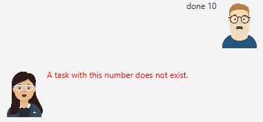

# User Guide
This is a user guide for the users of Duchess, a Chatbot related to Duke.

 

# Features 
### Keyword: `bye`
Exits the app.
### Keyword: `list`
Lists all the tasks currently in the tasklist.
### Keyword: `undo`
Undoes the most recent modification to the tasklist.
### Keyword: `find`
Searches for tasks containing the specified words.
### Keyword: `delete`
Delete the specified task.
### Keyword: `done`
Marks a specified task as done.
### Keyword: `todo`
Adds a todo task with the specified description to the tasklist.
### Keyword: `event`
Adds a event task with the specified description and time to the tasklist.
### Keyword: `deadline`
Adds a deadline task with the specified description and time to the tasklist.
### Unknown Keyword
User is asked to input a recognised command.
### Enter or Send with no typed message
Nothing happens.

 

# Usage of keywords
<!-- ### `Keyword` - Describe action -->
### Keyword - `bye`
Example of usage: `bye`

Expected outcome: App Exits.

### Keyword - `list`
Example of usage: `list`

Expected outcome: All tasks currently in the tasklist will be returned.

### Keyword - `undo`
Example of usage: `undo`

Expected outcome: If the previous command was `delete 1`, the deleted task would be restored to the tasklist.

### Keyword - `find`
Example of usage: `find read book`

Expected outcome: All Tasks containing the words `read` or `book` will be returned.

### Keyword - `delete`
Example of usage: `delete 1`

Expected outcome: The first task in the tasklist will be deleted.

### Keyword - `done`
Example of usage: `done 1`

Expected outcome: If the first task in the list was not previously marked as done, it will now be marked as done. Otherwise, nothing happens.

### Keyword - `todo`
Example of usage: `todo borrow book`

Expected outcome: A Todo task with the specified description is added to the tasklist.

### Keyword - `event`
Example of usage: `event go to a party /at 2021-01-01`

Expected outcome: An Event task with the specified time and description is added to the tasklist.

### Keyword - `deadline`
Example of usage: `deadline finish homework /by 2021-01-01`

Expected outcome: A deadline task with the specified time and description is added to the tasklist.

 

# Example Use of App
This is a demonstration of the app, if the taskList started from a clean state when the app starts.
### `list`

### `todo borrow book`

### `list`

### `delete 1`

### `list`

### `undo`

### `list`

### `lala`

### `deadline do homework`

### `done 10`
