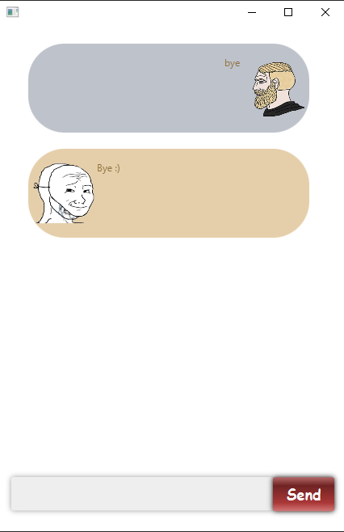

# Chadbot - User Guide

## Introduction
**Chadbot** is a greenfield Java project modified from the _Duke_ project. The project was created for NUS's software
engineering module, CS2103T.

Chadbot is a simple application which will help you keep track of your tasks. Chadbot differentiates between the
following types of tasks:
* Todos: Tasks without any special features.
* Deadlines: Tasks which are to be completed by a specified date.
* Events: Tasks which are held on a specified date.

## Features
1. **Create:** adds a task into the task list.
    ```
   todo <description>
   deadline <description> /by <date>
   event <description> /at <date>
   ```
1. **Read:** shows the tasks in the task list.
    ```
   list
   ```
1. **Update:** edits a task in the task list.
    ```
   edit <index> /desc <description>
   edit <index> /date <date>
   ```
1. **Delete:** removes a task from the task list.
    ```
   delete <index>
   ```
1. **Exit:** terminates Chadbot.
    ```
   bye
   ```
1. **Search:** finds a list of tasks associated with a date or containing a keyword.
    ```
   list <date>
   find <keyword>
   ```
1. **Mark:** marks a task in the task list as done.
    ```
   done <index>
   ```
1. **Arrange:** sorts the list of tasks into the specified ordering.
    ```
   sort
   sort /by type
   sort /by date
   ```
1. **Stats:** shows the tally of to-dos, deadlines, and events in the task list.
    ```
   stats
   ```
1. **Help:** displays a help page containing commands supported by Chadbot.
    ```
   help
   help /more
   ```

## Usage

1. ### Create

    * `todo <description>` - Adds a _to-do_ to the task list.

        **Example of usage:** `todo cs2103t ip`

        Adds a simple _to-do_ with description "cs2103t ip" to the back of the task list.

        **Expected outcome:**

        

    * `deadline <description> /by <date>` - Adds a _deadline_ to the task list.

        **Example of usage:** `deadline cs2104 tutorial /by 2021-02-12`

        Adds a _deadline_ with description "cs2104 tutorial" and due date "2021-02-12" to the back of the task list.

        **Expected outcome:**

        

    * `event <description> /at <date>` - Adds an _event_ to the task list.

        **Example of usage:** `event cs2105 exam /at 2021-03-21`

        Adds an _event_ with description "cs2105 exam" and date "2021-03-21" to the back of the task list.

        **Expected outcome:**

        

1. ### Read

    * `list` - Shows all task(s) in the task list.

        **Example of usage:** `list`

        Prints the three tasks that were previously added on the GUI.

        **Expected outcome:**

        

1. ### Update

    * `edit <index> /desc <description>` - Edits the description of a task in the task list.

        **Example of usage:** `edit 1 /desc cs2103t tp-gui`

        Updates the description of the task at index 1 to "cs2103t tp-gui".

        **Expected outcome:**

        

    * `edit <index> /date <date>` - Edits the date of a task in the task list.

        **Example of usage:** `edit 2 /date 2021-03-01`

        Updates the date of the task at index 2 to "2021-03-01".

        **Expected outcome:**

        

1. ### Delete

    * `delete <index>` - Removes a task from the task list.

        **Example of usage:** `delete 1`

        Deletes the task at index 1 from the task list.

        **Expected outcome:**

        

1. ### Exit

    * `bye` - Terminates the Chadbot application.

        **Example of usage:** `bye`

        A bye message appears, and the application closes after a 0.5 second delay.

        **Expected outcome:**

        

1. ### Search

    * `list <date>` - Finds a list of deadlines and events associated with the given date.

        **Example of usage:** `list 2021-03-01`

        Prints a list of deadlines due and events happening on "2021-03-01".

        **Expected outcome:**

        

    * `find <keyword>` - Finds a list of tasks associated with the given keyword.

        **Example of usage:** `find cs2105`

        Prints a list of tasks containing the keyword "cs2105".

        **Expected outcome:**

        

1. ### Mark

    * `done <index>` - Marks a task in the task list as done.

        **Example of usage:** `done 1`

        Marks the task at index 1 as done.

        **Expected outcome:**

        

1. ### Arrange

    * `sort` - Sorts the task list into alphabetical ordering.

        **Example of usage:** `sort`

        Sorts the task list into alphabetical ordering.

        **Expected outcome:**

         

    * `sort /by type` - Sorts the task list based on the type of the tasks.

        **Example of usage:** `sort /by type`

        Sorts the task list into an order beginning with to-dos, followed by deadlines, and then events.

        **Expected outcome:**

         

    * `sort /by date` - Sorts the task list based on the type of the tasks, and then by their date.

        **Example of usage:** `sort /by date`

        Sorts the task list first by their type, and then by their date.

        **Expected outcome:**

         

1. ### Stats

    * `stats` - Shows the tally of to-dos, deadlines, and events in the task list.

        **Example of usage:** `stats`

        Shows the tally of to-dos, deadlines, and events in the task list.

        **Expected outcome:**

        

1. ### Help

    * `help` - Displays a help page containing commands supported by Chadbot.

        **Example of usage:** `help`

        Shows the first page of the help sheet.

        **Expected outcome:**

        

    * `help /more` - Displays a help page containing commands supported by Chadbot.

        **Example of usage:** `help /more`

        Shows the second page of the help sheet.

        **Expected outcome:**

        
