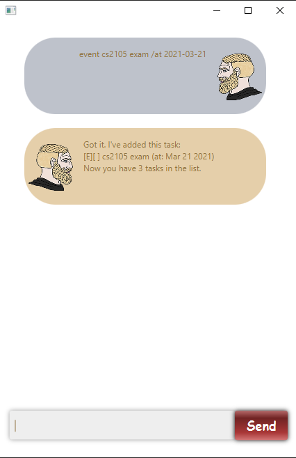
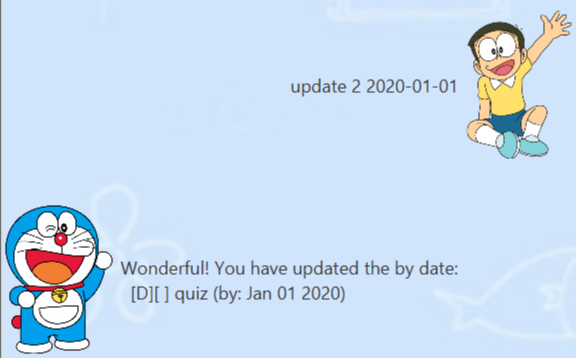

# User Guide

## Content Page
1. [Introduction](#1-introduction)
2. [Getting Started](#2-getting-started)
3. [Features](#3-features)
4. [Additional Help](#4-additional-help)
5. [Acknowledgements](#5-acknowledgements)

## 1. Introduction 
Welcome to Duke, your one stop task manager! :smile:
With great usability and a simple design, it's never been easier to manage your tasks!

## 2. Getting Started
1. Ensure that you have at least `Java 11` installed.
2. Download the software [here](https://github.com/JodyLorah/ip/releases/tag/v0.2)
3. Once downloaded, you should see the welcome page:

   
4. Great! You're all set. Happy exploring! :grin:

## 3. Features
1. [Adding Tasks](#31-adding-tasks)
2. [Deleting Tasks](#32-deleting-tasks)
3. [Updating Tasks](#33-updating-tasks)
4. [Marking Task as Done](#34-marking-task-as-done)
5. [View Tasks](#35-view-tasks)
6. [Find Tasks](#36-find-tasks)
7. [Exit](#37-exit)
8. [In-App Help](#38-in-app-help)
### 3.1 Adding Tasks
###### Tutors suddenly bombarding you with assignments and you can't keep track of it? :no_mouth: Let `Duke` help you!
##### There are 3 different types of tasks you can add: `todo`, `deadline` and `event` tasks.
#####`todo` task: _`todo <task name>`_ 
 * _Add a task to be done with no specific timing._

#####`deadline` task: _`deadline <task name> /by <DD/MM/YYYY HH:mm>`_
* _Add a task with a deadline and time._

#####`event` task: _`event <task name> /at <DD/MM/YYYY HH:mm>`_
* _Add an event with its corresponding date and time._

  
### 3.2 Deleting Tasks
###### Added something wrongly? :cold_sweat: Don't worry! 
#### Change it with the `delete` instruction.
#####`delete`: _`delete <task number>`_
* _Delete a task corresponding to its task number._

### 3.3 Updating Tasks
###### Teammates suddenly rescheduled your meeting timing? :unamused: No problem. 
#### Just `update` the corresponding task!
#####`update`: _`update <task number> /to [<task format>](#3.1-adding-tasks)`_
* _Update details of a task corresponding to its task number._

### 3.4 Marking Task as Done
###### Finally done with the task but don't want to delete it so you can see how much you accomplished? :nerd_face: 
#### Just mark it as `done`.
#####`done`: _`done <task number>`_
* _Marks task with a `X` to show it's done._

  
### 3.5 View Tasks
###### So many tasks you can't even remember what you have? :exploding_head: 
#### Just type `list` to view all the tasks you have!
#####`list`: _`list`_
* _Shows a list of all added tasks._

### 3.6 Find Tasks
###### I swear I still had to do something from 2103 but where is it on my list? :woozy_face:
#### Just `find` the keyword you are looking for!
#####`find`: _`find <keyword>`_
* _Shows a list of all the tasks with the given keyword._

### 3.7 Exit
###### Finally done with organising my tasks. Time to start on them :sob:
#### Just type `bye` to save the tasks added.
#####`bye`: _`bye`_
* _Saves all tasks added before closing the app._

### 3.8 In-App Help
###### So many instructions, so little brain! How to remember all the instructions :astonished:
#### Just type `help` in `Duke` to see all available commands!
#####`help`: _`help`_
* _Shows a list of all commands._

## 4. Additional Help
Q: Do I need to copy the Github repo to be able to use Duke? \
A: Nope you just need to [download](https://github.com/JodyLorah/ip/releases/tag/v0.2) the .jar file to run it!

Q: Why am I unable to run the JAR file? \
A: Please ensure that your laptop supports at least `Java 11`.

If you have any other queries, feel free to contact me on [GitHub](https://github.com/JodyLorah)!

## 5. Acknowledgements
Thank you @ruilingk for letting me reference your UI.
[Image of DaDuke](https://www.refinery29.com/images/10251619.jpg)
[Image of DaUser](https://www.refinery29.com/en-us/2020/12/10226515/bridgerton-netflix-cast-characters-actors#slide-1)