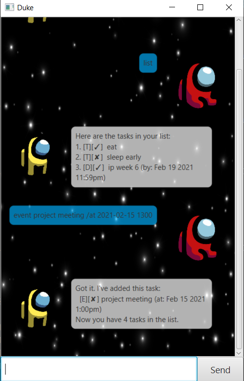

# Juke Bot User Guide

Welcome to Juke's user guide. This is a comprehensive user guide to teach you how to use the chat bot, Juke.

Juke is a command-line based Task Manager application. A user will type a series of command to instruct Juke.

## User Interface


## Content Page
Here is an overview of the commands that Juke supports and a user can input.
* [help]
* [todo]
* [deadline]
* [event]
* [delete]
* [find]
* [done]
* [list]
* [bye]
<br/><br/>


## Features 

### Task Manager
Juke Chat Bot is a personal task manager. It allows users to add, delete and search tasks.

## Usage

### `help` 
* Description: Shows a list of supported commands and their descriptions.
* Format: `help`
* Example: `help`

### `todo`
* Description: Creates a todo task and adds it to your task list.
* Format: `todo <description>`
* Example: `todo read book`
* Expected outcome: 
```
Got it. I've added this task. 
[T][X] read book

```
<p align="center">
  
</p>


### `deadline`
* Description: Creates a deadline task due at a specific date and time and adds it to your task list.
* Format: `deadline <description> /by <yyyy-MM-dd HH:mm>`
* Example: `deadline group project /by 2021-01-10 1800` 
* Expected outcome: 
```
Got it. I've added this task. 
[D][X] group project (by:Jan 10 2021 6PM) 

```

### `event`
* Description: Creates an event task with an event at a specific date and time and adds it to your task list.
* Format: `event <description> /at <yyyy-MM-dd HH:mm>`
* Example: `event meeting /at 2021-01-10 1800` 
* Expected outcome: 
```
Got it. I've added this task. 
[E][X] meeting (at:Jan 10 2021 6PM) 

```

### `delete`
* Description: Shows a list of supported commands and their descriptions.
* Format: `help`
* Example: `help`

### `find`
* Description: Shows a list of supported commands and their descriptions.
* Format: `help`
* Example: `help`

### `done`
* Description: Shows a list of supported commands and their descriptions.
* Format: `help`
* Example: `help`

### `list`
* Description: Shows a list of supported commands and their descriptions.
* Format: `help`
* Example: `help`

### `bye` 
* Description: Shows a list of supported commands and their descriptions.
* Format: `help`
* Example: `help`


