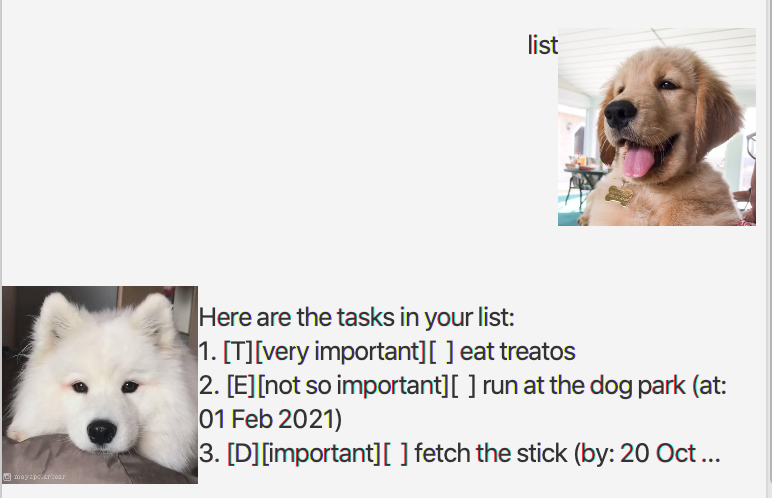
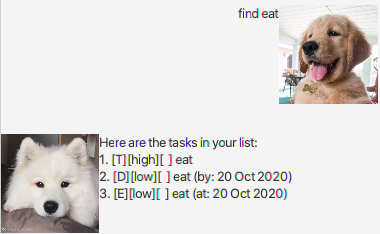
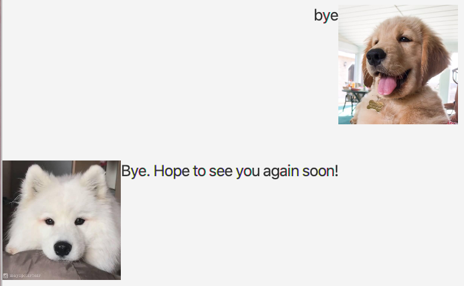

# User Guide

## Features 

1. Display task list 
1. Add a Todo task
1. Add a Deadline task
1. Add an Event task
1. Search task
1. Mark task as done
1. Remove task
1. Say goodbye

## Usage

### `list` - Displays the task list.

Displays the tasks contained in the task list. Tasks will be displayed by the order of adding to the task list.
Older tasks will be displayed first.

Example of usage: 

`list`

Expected outcome:

### `todo <task description> /p <level of priority>` - Adds a Todo task

Adds a Todo task with no time limit into the task list. 
Task description and level of priority are Strings that cannot be empty.

Example of usage:

`todo eat /p high`

Expected outcome:

### `deadline <task description> /by <YYYY-MM-DD> /p <level of priority>` - Adds a Deadline task

Adds a task that needs to be done before a specific date/time into the task list. 
Task description and level of priority are Strings that cannot be empty. Date must follow the format YYYY-MM-DD.

Example of usage:

`deadline eat /by 2020-10-20 /p low`

Expected outcome:

### `event <task description> /by <YYYY-MM-DD> /p <level of priority>` - Adds an Event task

Adds a task that start at a specific time into the task list.
Task description and level of priority are Strings that cannot be empty. Date must follow the format YYYY-MM-DD.

Example of usage:

`event eat /at 2020-10-20 /p low`

Expected outcome:

### `find <search keyword>` - Search tasks

Searches the task list for all tasks with descriptions that contain the search keyword.

Example of usage:

`find eat`

Expected outcome:

### `done <index>` - Mark a task as done.

Mark a specific task in the task list as done by specifying its index.

Example of usage:

`done 2`

Expected outcome:

### `delete <index>` - Remove task

Remove a specific task from the task list by specifying its index.

Example of usage:

`delete 2`

Expected outcome:

### `bye` - Says goodbye

Gets Maya to say her goodbye message.

Example of usage:

`bye`

Expected outcome:

