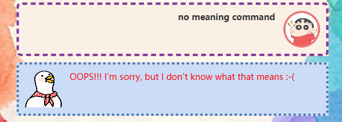

# User Guide
Duck is a personal assistant chat-bot that helps a person to keep track of various 
tasks including todo task, deadline task, and event task. It can record specific tasks,
mark completion, obtain the selected task time limit and generate schedule automatically.

##Usage
1.Duck runs under java 11 or above version.

2.Download the app, and double-click the file to start.

3.Type the command in the command box and press Enter to execute it.

4.use command to record and manage tasks. Master can add multiple tasks, 
mark completed tasks, find required task.

5.use command to get time before set date and generate schedule.

## Features 

### `list` - list all tasks 

Shows a list of all tasks in the Duck GUI.

Format:`list`

Example:

### `todo` - add todo task

Add a new todo Task including the specific  description. 
The task is marked as incomplete first.

Format:`todo DESCRIPTION `

Example:`todo washing clothes`  

### `deadline ` - add deadline task

Add a new deadline Task including the specific description and deadline. 
The task is marked as incomplete first.

Format:`deadline DESCRIPTION /by DEADLINE `

* The deadline entered must follow the time format YYYY-MM-DD. 

Example:`deadline hand in homework /by 2021-02-16`

### `event` - add event task

Add a new event Task including the specific description and event starting time. 
The task is marked as incomplete first.

Format:`event DESCRIPTION /at STARTING DATE`

Example:`event atteand meeting /at 2021-03-16 `

### `done` - mark task 

Mark selected task as complete.
Usually use this command following list command.

Format:`done INDEX `

* Done the task at the specified INDEX.
* The index refers to the index number shown in the displayed task list.
* The index must be a positive integer 1, 2, 3, … ,total number of tasks.

Example:`done 5`

### `delete` - delete task

Delete selected Task from the task list. 
Usually use this command following list command.

Format:`delete INDEX`

Example:`delete 8`

### `date` - time to task date 

Get period from now to the selected task date.Usually use this command following list command.
if the selected task is todo task, Duck will reply "the task hasn't determined the time".

Format:`date INDEX `

Example:`date 3`

### `find` - find task by keyword 

Find tasks which descriptions include the given keyword, and show them in a list. 

Format:`find KETWORD`

* The searching for tasks is case-insensitive.
* Only search the task descriptions but ignore the date.

Example:`find book`  

### `schedule` - create a schedule 

Create a schedule according to task date. Help master arrange time reasonably. 

Format:`schedule `

Example:

### `error management`

If master input no-meaning command or incorrect format message, Duck will reply the
error message which is red.

##data transfer 

If wanting to install the app in the other computer and transfer the data,
master can overwrite the empty data file (data/duck.txt). It creates with 
the file that contains the data of previous folder.
