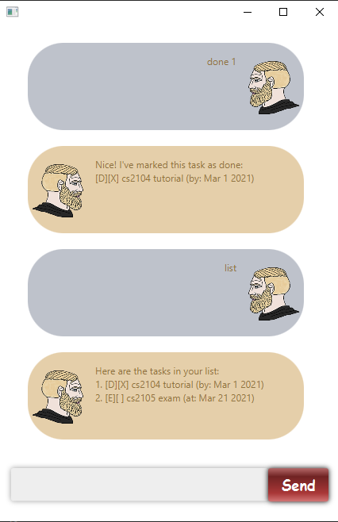

# User Guide

## Features 
1. Adding a task, such as todo, event, deadline, to Duke
1. Listing all tasks added
1. Deleting a task added
1. Marking a task added as done
1. Finding tasks by searching a keyword
1. Updating the by date of a deadline added

## Usage

### `todo <description>` - Adds a todo

Adds a todo with the given description to Duke.

Example of usage: 

`todo complete quiz`

Expected outcome:

### `event <description> /at <date>` - Adds an event

Adds an event with the given description and event date to Duke.  
- Do kindly note that Duke **does not understand** the date entered for **events**.   
It will just display the entered date as it is.

Example of usage:

`event party /at this sunday`

Expected outcome:

### `deadline <description> /by <date>` - Adds a deadline

Adds a deadline with the given description and by date to Duke.
- Do kindly note that Duke **understands** the date entered for **deadlines**.   
  Thus, date entered has to be valid and follow a **`yyyy-mm-dd`** format, e.g. `2021-02-17`.

Example of usage:

`deadline quiz /by 2021-02-17`

Expected outcome:

### `list` - Lists all tasks added

Lists all tasks added to Duke so far.

Example of usage:

`list`

Expected outcome:

### `delete <task index>` - Deletes a task

Deletes a task with the given task index as shown in list.
- Do kindly note that the task index given must be valid.

Example of usage:

`delete 1`

Expected outcome:

### `done <task index>` - Marks a task as done

Marks a task with the given task index as done.
- Do kindly note that the task index given must be valid.

Example of usage:

`done 1`

Expected outcome:

### `find <keyword>` - Finds tasks by searching a keyword

Finds all tasks with description containing the given keyword.

Example of usage:

`find quiz`

Expected outcome:

### `update <deadline index> <new date>` - Updates the date of a deadline

Updates the date of a deadline (with the given task index) to the given new date.
- Do kindly note that the task index given must be valid and referring to a deadline, 
  the new date must be valid and follows a **`yyyy-mm-dd`** format, e.g. `2021-02-17`.
- Do kindly note that there must be a whitespace between `<deadline index>` and `<new date>`. 
  Otherwise, it will be understood as an invalid task index.
- E.g. `update 22010-01-01` is not allowed, but `update 2 2010-01-01` is allowed.

Example of usage:

`update 2 2020-01-01`

Expected outcome:

