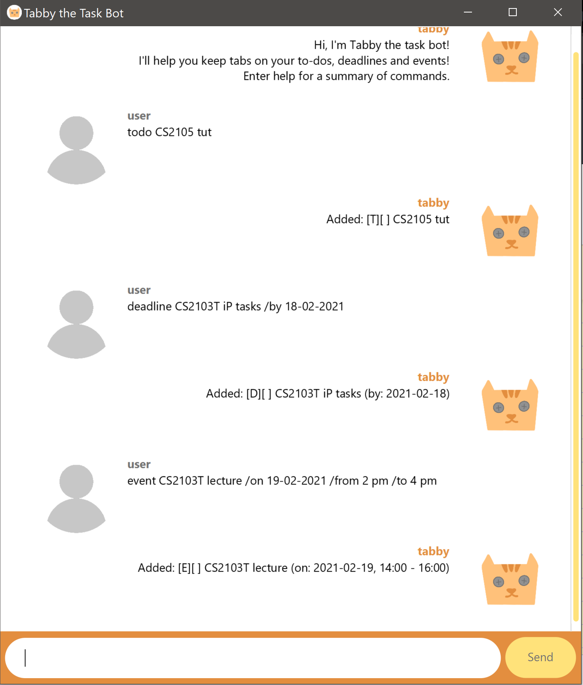

# User Guide

## Features 

### View help: `help`

Shows a summary of the commands that Tabby recognises.

 

### List tasks: `list`

Shows full task list.

 

### Mark task as done: `done`

Marks the specified task on the task list as done.

 

### Delete task: `delete`

Deletes specified task from the task list.

 

### Find tasks: `find`

Finds all tasks containing the specified keyword in their description.

 

### Add new tasks: `todo`, `deadline`, `event`

Adds new tasks of the types todo, deadline or event to the list.

 

### Undo action: `undo`

Undos previously executed actions.

 

### Redo action: `redo`

Redos previously undone actions.

 

### Exit bot: `bye`
Closes the bot.

  

## Usage

### `help` - View help

Tabby will reply with a list of all instructions it recognises.

Example of usage: 

    help

Expected outcome:

 

### `list` - List tasks

Tabby will reply with a full list of all the tasks entered so far.

Example of usage:

    list

Expected outcome:

 

### `done` - Mark task as done

Task specified will be marked as done. Tasks are identified by their position in the task list.

Format: `done [position number]`

Example of usage:

    done 1

Expected outcome:

 

### `delete` - Delete task

Task specified will be deleted from the task list. Tasks are identified by their position in the task list.

Format: `delete [position number]`

Example of usage:

    delete 3

Expected outcome:

 

### `find` - Find tasks

Tabby will reply with a list of all tasks that contain the specified keyword in their task description. The number on the left of the task indicates its position in the task list.

Format: `find [keyword]`

Example of usage:

    find CS2103T

Expected outcome:

 

### `todo` - Add new todo task

A new todo task will be added to the task list. Todo tasks do not have specific start/end dates/times.

Format: `todo [description of task]`

Example of usage:

    todo CS2105 tut

Expected outcome:

 

### `deadline` - Add new deadline task

A new deadline task will be added to the task list. Deadline tasks have to be completed by the specified date.

Format: `deadline [description of task] /by [deadline in dd-mm-yyyy format]`

Example of usage:

    deadline CS2103T iP tasks /by 18-02-2021

Expected outcome:

 

### `event` - Add new event task

A new event task will be added to the task list. Event tasks occur on a specific date during a specific duration.

Format: `event [description of task] /on [date of event in dd-mm-yyyy format] /from [start time in h am/pm format] /to [end time in h am/pm format]`

Example of usage:

    event CS2103T lecture /on 19-02-2021 /from 2 pm /to 4 pm

Expected outcome:

 

### `undo` - Undo previous action

Previous action will be undone, starting from most recent action first.

Example of usage:

    undo

Expected outcome:

 

### `redo` - Redo previously undone action

Previously undone action will be done again, starting from most recently undone action first.

Example of usage:

    redo

Expected outcome:

 

### `bye` - Exit bot

Bot closes.

Example of usage:

    bye

Expected outcome:

