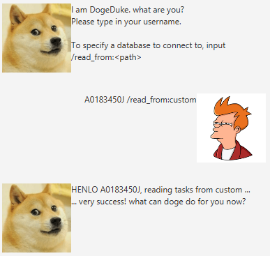

# User Guide
User guide for the use of task management chatbot dogeDuke.

## Features 

### LogIn
#### Command: `USERNAME [/read_from:DIRECTORY_PATH]`
- Sets up the username for dogeDuke to address the user and reads any stored data from 
  USERNAME.txt in the DIRECTORY_PATH.
- Where DIRECTORY_PATH is invalid or unspecified, defaults to userdata in the 
  current working directory.
- DogeDuke greets the user and prompts for subsequent actions post-set up.

#### Example Usage:
`A0183450J /read_from:custom`
#### Expected Outcome:
- Sets username as A0183450J and reads the stored data from custom/A0183450J.txt file.
- DogeDuke greets "HENLO A0183450J ..."

### Listing All Tasks
#### Command: `list`
- Lists information of all tasks in queue regardless of their current state.
- Task information include the type of task (T: todo, E: event, D: deadline), whether the 
  task has been done (marked by X), the description of the task, datetime of creation and 
  other information.
- Responds to user with banter when there are no tasks in the queue.

### Listing Undone Tasks
#### Command: `undone`
- Lists information of outstanding undone tasks in queue.
- Task information as per the **list** command.
- Responds to user with praise when there are no outstanding tasks in the queue.

### Search Tasks by Task Description
#### Command: `find SEARCH TEXT PHRASE`
- Lists the matched tasks with the SEARCH TEXT PHRASE in their task description.
- Task information as per the **list** command.

#### Example Usage:
`find hidden task`
#### Expected Outcome:
- Returns a list of tasks with "hidden task" as a substring in the task descriptions.

### Mark Task as Done
#### Command: `done INDEX`
- Marks the task at the specified INDEX (one-based indexing) as done.
- Shows the task that was marked done as per the **list** command.

#### Example Usage:
`done 1`
#### Expected Outcome:
- Marks the task at INDEX 1 as done.

### Removing Task from Queue
#### Command: `remove INDEX` or `delete INDEX`
- Removes the task at the specified INDEX (one-based indexing) from the queue, resetting 
  the indices of the remaining tasks as a consequence.
- Shows the deleted task information as per the **list** command.

#### Example Usage:
`remove 1`
#### Expected Outcome:
- Removes the task at INDEX 1 from the queue. INDEX 1 now refers to the next task at the
  previous INDEX 2.

### Adding Todo Task to Queue
#### Command: `todo TODO DESCRIPTION`
- Adds a todo task (undone) to the queue with the task description as the specified TODO 
  DESCRIPTION.
- Shows the newly added task information as per the **list** command.

#### Example Usage:
`todo IP increments`
#### Expected Outcome:
- Adds a todo task with the description "IP increments", in an undone state and creation
  datetime as the current datetime.

### Adding Event Task to Queue
#### Command: `event EVENT DESCRIPTION /at DATETIME`
- Adds an event task (undone) to the queue with the task description as the specified
  EVENT DESCRIPTION and the timing of the event as the DATETIME.
- The format of the DATETIME argument must be YYYY-MM-DD HHmm.
- Shows the newly added task information as per the **list** command.

#### Example Usage:
`event LNY Reunion Dinner /at 2021-02-11 1830`
#### Expected Outcome:
- Adds an event task with the description "LNY Reunion Dinner", in an undone state,
  at 11 Feb 2021 6:30pm and creation datetime at current datetime.

### Adding Deadline Task to Queue
#### Command: `event DEADLINE DESCRIPTION /by DATETIME`
- Adds a deadline task (undone) to the queue with the task description as the specified
  DEADLINE DESCRIPTION and the deadline timing as the DATETIME.
- The format of the DATETIME argument must be YYYY-MM-DD HHmm.
- Shows the newly added task information as per the **list** command.

#### Example Usage:
`deadline IP Submission /by 2021-02-19 2359`
#### Expected Outcome:
- Adds a deadline task with the description "IP Submission", in an undone state,
  to be done by 19 Feb 2021 11:59pm and creation datetime at current datetime.

### Exiting the App
#### Command: `bye`
- Update tasks to the database and exits the app.
- Where DIRECTORY_PATH/USERNAME.txt as per the LogIn setup does not exist, DogeDuke creates
  the directory and file.
  
## Example Use of DogeDuke
- App start up and setting up of user

  

- Adding an event task

- Listing tasks

- marking as done

- listing undone tasks

