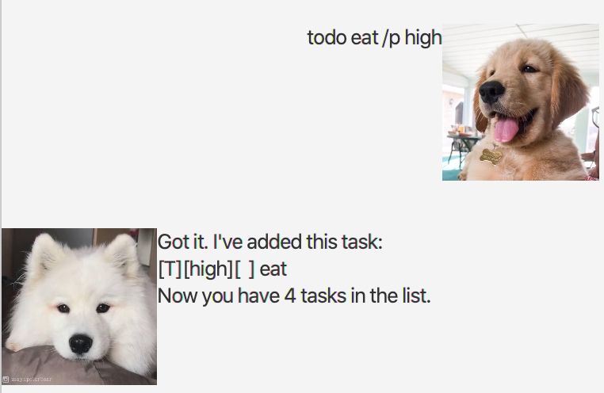
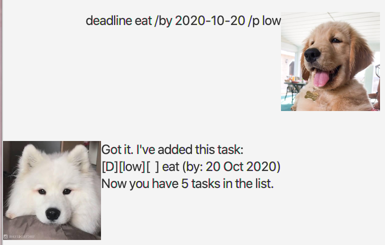
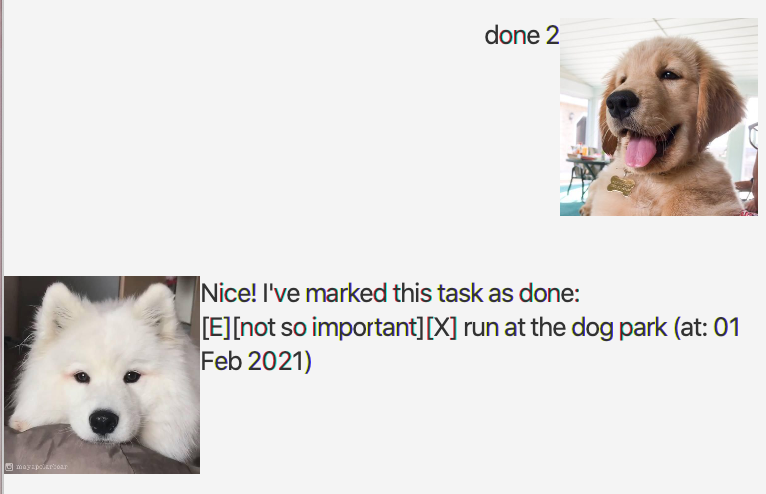
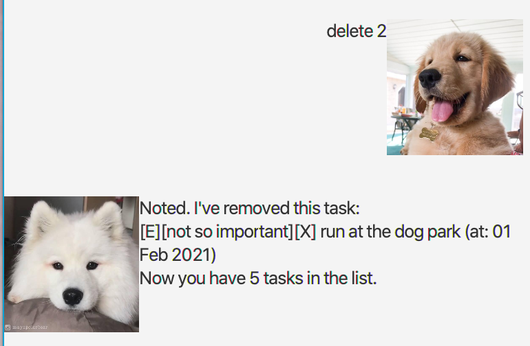

# User Guide

Hi I'm Chip the Squirrel, a personal assistant chatbot to help you keep track of your deadlines, events and todos.

## Features

Below are some commands that I understand. Commands are not case-sensitive, so I understand 'help', 'Help' and 'HELP'.
We squirrels are smart creatures!

### Command  Format

Words in `UPPER_CASE` are parameters to be supplied by the user.

`<Angle Brackets>` and `(Round Brackets)` are used to denote compulsory and optional parameters respectively.
`...` is used to denote that one or more parameters are accepted.

### Seeking Help

The help command helps you remember what each command does. Help is always a 'help' away!

### `help (COMMAND)` - get information about syntax

Typing `help` will display the commands that are available. Typing help followed by the name of the command will display
more info on how the command can be used.
(COMMAND) should be a valid command.

Example of usage:

`help`

Expected outcome:

### Quitting the Application

The bye command quits the application. Don't worry I'll remember all your tasks the next time you come back!

### `bye` - quits the application

Typing `bye` will quit the application.

Example of usage:

`bye`

Expected outcome:

Application quits.

### Adding Todos

Add a todo and I'll remember it for you!

### `todo <DESCRIPTION>` - Add a todo

Typing `todo` followed by a description adds a todo to your list of tasks.
<DESCRIPTION> can be made out of one or many words.

Example of usage:

`todo Find Acorns`

Expected outcome:

### Adding Deadlines

Add a deadline and I'll remember it for you!

### `deadline <DESCRIPTION> /by <DATE> (TIME)` - Add a deadline

Typing `deadline` followed by a description, date and optional time field adds a deadline to your list of tasks.
<DESCRIPTION> can be made out of one or many words.
<DATE> should be in yyyy-mm-dd format
(TIME) is optional and should be in hh:mm format

Example of usage:

`deadline Assignment 1 /by 2021-02-14 23:59`

Expected outcome:

### Adding Events

Add an event and I'll remember it for you!

### `event <DESCRIPTION> /at <DATE> (TIME)` - Add an  event

Typing `event` followed by a description, date and optional time field adds an event to your list of tasks.
<DESCRIPTION> can be made out of one or many words.
<DATE> should be in yyyy-mm-dd format
(TIME) is optional and should be in hh:mm format

Example of usage:

`event Squirrel Appreciation Day /at 2021-01-21`

Expected outcome:

### List out all tasks

I can list out your task for you!

### `list` - Lists out all tasks

Displays a list of all tasks.

Example of usage:

`list`

Expected outcome:

### Mark task as done

You can let me know what tasks you have completed!

### `done <TASK_NUMBER>` - Describe action

Typing `done` followed by the task number marks the task as done. A `[X]` signifies that a task has been completed. If
you are unsure of the task number, you can list out all tasks using the `list` command.

Example of usage:

`done 1`

Expected outcome:

### Deleting a task

Let me know if you would like a task to be deleted forever. Don't worry any secrets are safe with me!

### `delete <TASK_NUMBER>` - Describe action

Typing `delete` followed by the task number deletes the task. If you are unsure of the task number, you can list out all
tasks using the `list` command.

Example of usage:

`delete 1`

Expected outcome:

### Finding a task

Let me know what you are looking for!

### `find <SEARCH_PARAMETERS...>` - Describe action

You can search for a task using the find command. One or more search parameters are accepted. The program will attempt
to find all tasks that contain any of the search parameters. Search parameters are case-insensitive.

Example of usage:

`find birthday tree`

Expected outcome:

