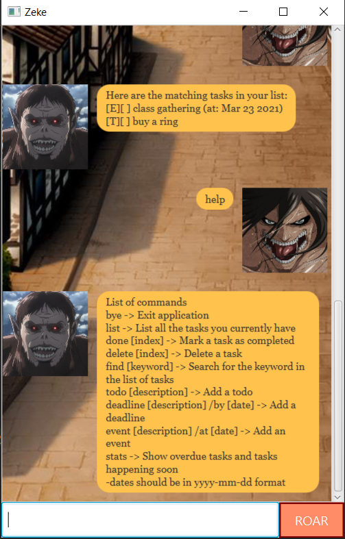

# User Guide

* [Introduction](#introduction-to-zeke)
* [Get Started](#get-started)
* [Features](#features)
    * [At a glance](#at-a-glance)
    * [Add Tasks](#add-tasks)
    * [Delete Tasks](#delete-tasks)
    * [List All Tasks](#list-all-tasks)
    * [Mark tasks as completed](#mark-tasks-as-completed)
    * [Search for tasks](#search-for-tasks)
    * [Display help menu](#display-help-menu)
    * [Display statistics](#display-statistics)
    * [Exit the application](#exit-the-application)

## Introduction to Zeke
Zeke is a Personal Assistant Chatbot that helps you keep track of various tasks.
This application makes use of a Command-Line Interface (CLI) which processes commands in the form of lines of text.
You can give commands to Zeke and it will return the relevant messages.

 

## Get started
1. Ensure that [JDK 11](https://www.oracle.com/sg/java/technologies/javase-jdk11-downloads.html) or newer versions are installed on your computer.
2. Download zeke.jar [here](https://github.com/xinweit/ip/releases/tag/v1) to a path of your choice in your computer.
3. Run the zeke.jar file.
4. You can now start using the app!

 

## Features

## At a glance

Feature | Command format
------------ | -------------
Add todo | `todo <description>` 
Add deadline | `deadline <description> /by <date>`
Add event | `event <description> /at <date>`
Delete task| `delete <index>`
View all tasks | `list`
Mark task as completed | `done <index>`
Search for tasks | `find <keyword>`
View help menu | `help`
View statistics | `stats`
Exit application | `bye`

 

## Add Tasks 
Users can add tasks of these 3 types to their task list:
* Todo: Something that needs to be done
* Deadline: A task that needs to be completed by a certain date
* Event: An event that happens at a certain date

## Usage

### `todo <description>` - Add a Todo

description: the description of the todo you want to add

Example of usage: 

`todo buy groceries`

Expected outcome:

 

### `deadline <description> /by <date>` - Add a Deadline

description: the description of the deadline you want to add  
date: the date of the deadline in _**yyyy-mm-dd**_ format

Example of usage:

`deadline return book /by 2021-11-19`

Expected outcome:

 

### `event <description> /at <date>` - Add an Event

description: the description of the event you want to add  
date: the date of the event in _**yyyy-mm-dd**_ format

Example of usage:

`event football at kallang cage /at 2021-11-19`

Expected outcome:

 

## Delete Tasks
Users can delete tasks from their task list

## Usage

### `delete <index>` - delete a specified task

index: the index of the task you want to delete, 1-based indexing

Example of usage:

`delete 10`

Expected outcome:

 

## List all Tasks
Users can see all the tasks in their task list

## Usage

### `list` - show all tasks

Example of usage:

`list`

Expected outcome:

 

## Mark tasks as completed
Users can mark tasks as completed

## Usage

### `done <index>` - mark specified task as completed

index: the index of the task you want to delete, 1-based indexing

Example of usage:

`done 8`

Expected outcome:

 

## Search for tasks
Users can search for tasks in their task list

## Usage

### `find <keyword>` - search for a keyword 

keyword: the keyword to search

Example of usage:

`find ring`

Expected outcome:

 

## Display help menu
Users can see the help menu for list of available commands

## Usage

### `help` - shows the help menu

Example of usage:

`help`

Expected outcome:

 

## Display statistics 
Users can see overdue deadlines, events happening soon and deadlines due soon

## Usage

### `stats` - show useful statistics

Example of usage:

`stats`

Expected outcome:

 

## Exit the application
Users can exit the Zeke app

## Usage

### `bye` - exit app

Example of usage:

`bye`

Expected outcome:

