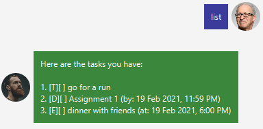
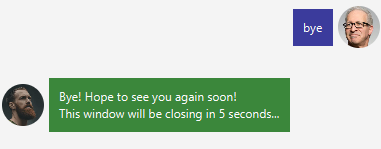

# User Guide

## Setting up

Ensure you have installed Java 11 or above.

Download the latest duke.jar [here](https://github.com/jlxw48/ip/releases/).

Copy the file to the folder you want to use as the home folder for Popo Task Manager.

Double-click the jar file to start the application. Alternatively, you can run the command `java -jar duke.jar` in your terminal or command line!

## Features

### `todo` - Create a todo task

Creates a todo task and adds it to your task list.

**Format:** `todo DESCRIPTION`

**Example of usage:**

`todo go for a run`

**Expected outcome:**

### `deadline` - Create a task with a deadline

Creates a task with a deadline and adds it to your task list.

**Format:** `deadline DESCRIPTION /by DATE`

**Example of usage:**

`deadline Assignment 1 /by 19 Feb 2359`

Expected outcome:

### `event` - Create an event

Creates an event and adds it to your task list.

**Format:** `event DESCRIPTION /at DATE`

**Example of usage:**

`event dinner with friends /at 19 Feb 21 1800`

**Expected outcome:**

### `list` - Lists all your current tasks in your task list

Lists all the tasks currently in your task list.

**Format:** `list`

**Example of usage:**

`list`

**Expected outcome:**

### `done` - Marks a task as done

Marks the task with the specified index number as done (see 1st image).

When `list` command is called, this is also indicated with an X in the checkbox (see 2nd image).

Repeating this command will inform you that this task has already been completed (see 3rd image).

**Format:** `done INDEX`
* The index must be a positive integer.
* The index must be within the range of index numbers displayed when `list` command is called.

**Example of usage:**

`done 1`

**Expected outcome:**

### `delete` - Deletes a task

Deletes a task from the task list with the specified index number.

**Format:** `delete INDEX`
* The index must be a positive integer.
* The index must be within the range of index numbers displayed when `list` command is called.

**Example of usage:**

`delete 1`

**Expected outcome:**

### `find` - Finds a task

Finds a task with the matching phrase.

**Format:** `find PHRASE`
* The phrase to match can be part of a word, or made up of a few words.

**Example of usage:**

`find with friends`

**Expected outcome:**

### `bye` - Goodbye!

Ends the conversation with the chatbot and closes the window after 5 seconds.

Tasks in the task list are also saved locally to a tasks.txt file.

**Format:** `bye`

**Example of usage:**

`bye`

**Expected outcome:**

### `help` - Displays all possible commands

Displays all possible commands and their formats.

**Format:** `help`, `help (COMMAND)`

**Example of usage:**

`help` (see 1st image)

`help find` (see 2nd image)

**Expected outcome:**

## FAQ

**Q**: What are the acceptable date formats?

**A**: Below are the acceptable date formats:
   * d/M/yyyy e.g. 19/2/2021
   * d MMM yy e.g. 19 Feb 21
   * dd-MM-yy e.g. 19-02-21

**Q**: What are the acceptable time formats?

**A**: Currently, we only accept 1 time format - 24h!
